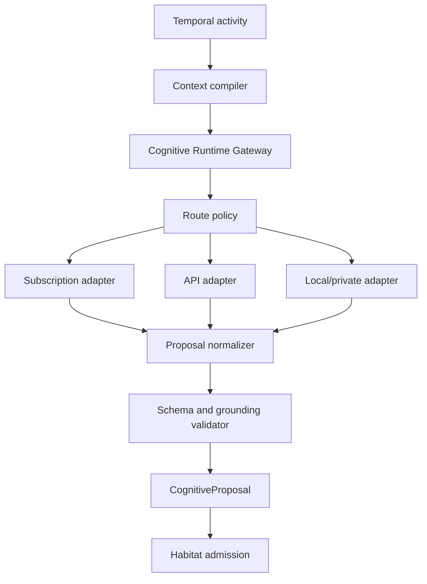

# Cognitive Runtime Gateway Contract

**Status:** Governing architecture contract, Revision 1.1  
**Applies to:** Autonomous Buyer Agent Operations System PRD Revision 7.1  
**Contract owner:** Product architecture  
**Authority boundary:** Cognitive runtimes propose; Habitat admits effects; Temporal executes durable workflows; PostgreSQL owns business truth

## 1. Purpose

The Cognitive Runtime Gateway makes cognitive execution replaceable across subscription-backed agent runtimes, metered model APIs, workspace or service-account agents, and approved local/private models without allowing a provider, model, SDK, subscription session, agent harness, or gateway to redefine the product.

The gateway is not an orchestrator, memory system, context compiler, connector gateway, policy engine, or system of record. It accepts a complete versioned cognitive work request and returns a schema-valid proposal or a typed failure.

## 2. Non-negotiable invariants

1. No cognitive runtime can execute an external effect.
2. No runtime receives connector write credentials, effect permits, unrestricted network access, or authority-bearing bearer tokens.
3. Every invocation begins from a newly compiled authoritative context packet. Provider thread history is optional cache, never truth.
4. Subscription and API authentication are separate first-class authentication and billing classes; neither is disguised as the other.
5. Provider, credential identity, authentication class, billing class, model/runtime family, and route-policy version are recorded for every invocation.
6. No route transition occurs unless the tenant/action-class route policy explicitly authorizes it.
7. A model response becomes a `CognitiveProposal` only after schema, provenance, grounding, context-sufficiency, recipient, policy, and output-safety validation.
8. A valid proposal is still not executable authority or canonical fact.
9. Temporal owns durable retries, deadlines, and recovery. Provider retry libraries may perform only bounded transport retries inside one recorded attempt.
10. PostgreSQL owns work state, routing configuration, credential references, evaluation qualification, and evidence correlation. Provider threads and local files do not.
11. Authentication failure, capacity exhaustion, unavailable providers, and schema failure are durable typed states; none permits false completion.
12. Raw Codex App Server is not a product dependency.
13. Every proposal and proposed action has a hard expiry. Habitat evaluates both proposal freshness and current canonical truth immediately before any effect.
14. A prohibited action is not made approvable by classification or human approval.

## 3. Runtime topology



## 4. Runtime families

| Family | Authentication examples | Execution characteristic | Required isolation |
|---|---|---|---|
| Subscription agent | Subscription OAuth, entitled workspace user | May have serialized sessions, quotas, embedded agent loop | Dedicated worker identity and measured concurrency lease |
| Workspace hosted agent | Workspace access token, service account | Asynchronous hosted run with provider-managed tools or connectors | Tenant/action allowlist and provider-run correlation |
| Direct model API | Metered API key, cloud IAM | Parallel schema/tool-capable inference | Scoped secret, rate budget, endpoint and model pin |
| Local/private model | Local endpoint token, workload identity | Product-controlled capacity and data boundary | Network allowlist, model digest, resource quota |

Agent-harness adapters and direct-model adapters must not be reduced to a lowest-common-denominator internal implementation. They share the normalized request/proposal boundary while retaining capability, context, tool, streaming, cancellation, and capacity differences in their profiles.

## 5. Core records

### 5.1 CognitiveWorkRequest

```ts
interface CognitiveWorkRequest {
  schemaVersion: string;
  workId: string;
  tenantId: string;
  principalId: string;
  buyerJourneyId: string;
  workflowId: string;
  actionClass: string;
  objective: string;
  contextManifestId: string;
  contextPacket: ContextPacket;
  contextSufficiencyContractVersion: string;
  requiredProposalSchemaVersion: string;
  routePolicyVersion: string;
  deadline?: string;
  retryBudget: RetryBudget;
  degradationPolicyVersion: string;
  traceId: string;
}
```

The request must not contain raw provider credentials, connector write credentials, effect permits, unrestricted MCP configuration, or hidden alternate routes.

### 5.2 CognitiveProposal

```ts
interface CognitiveProposal {
  schemaVersion: string;
  workId: string;
  actionClass: string;
  proposedActions: ProposedAction[];
  claims: GroundedClaim[];
  unknowns: BoundedUnknown[];
  assumptions: string[];
  risks: string[];
  confidence: number;
  requiredApproval: "none" | "agent" | "broker";
  policyDisposition: "eligible" | "approval_required" | "prohibited";
  proposedAt: string;
  expiresAt: string;
  contextManifestId: string;
  runtimeEvidence: RuntimeEvidence;
}

interface GroundedClaim {
  claimId: string;
  subjectRef: string;
  predicate: string;
  value: unknown;
  epistemicType: "assertion" | "verified_fact" | "inference";
  sourceIds: string[];
  freshnessAt: string;
  confidence?: number;
}

interface ProposedAction {
  proposalId: string;
  actionClass: string;
  targetRefs: string[];
  recipientRefs: string[];
  normalizedPayload: unknown;
  sourceClaimIds: string[];
  requestedExecutionWindow: { notBefore?: string; expiresAt: string };
  idempotencySeed: string;
}
```

The proposal schema is closed by version. Unknown action verbs, omitted required fields, ungrounded material claims, recipient ambiguity, malformed epistemic typing, invalid or missing expiry, or an expiry later than the action-class policy permits fails closed. `policyDisposition: prohibited` is retained only as denial evidence and cannot proceed to effect construction. Statically prohibited action classes should be rejected during gateway validation; dynamically prohibited actions are independently rejected by Habitat using current policy.

### 5.3 RuntimeEvidence

```ts
interface RuntimeEvidence {
  invocationId: string;
  attempt: number;
  routePolicyVersion: string;
  routeId: string;
  providerId: string;
  adapterId: string;
  adapterVersion: string;
  transport: string;
  credentialIdentityRef: string;
  authClass: AuthClass;
  billingClass: "subscription" | "metered" | "internal";
  modelFamily: string;
  resolvedModelId: string;
  capabilityProfileVersion: string;
  evaluationQualificationId: string;
  providerRunId?: string;
  startedAt: string;
  completedAt: string;
  usage: UsageRecord;
}
```

Secrets, refresh tokens, session cookies, raw credential caches, and hidden chain-of-thought must never be included.

## 6. Adapter interfaces

```ts
interface ProposalRuntime {
  descriptor(): RuntimeDescriptor;
  health(identityRef: string): Promise<RuntimeHealth>;
  invoke(request: AdapterRequest): Promise<AdapterResult>;
  cancel(invocationId: string): Promise<CancelResult>;
  usage(identityRef: string): Promise<UsageSnapshot>;
}

interface SubscriptionAgentRuntime extends ProposalRuntime {
  authState(identityRef: string): Promise<AuthState>;
  refreshSupportedAuth(identityRef: string): Promise<AuthState>;
  leaseCapacity(identityRef: string): Promise<CapacityLease>;
}

interface DirectModelRuntime extends ProposalRuntime {
  resolvePinnedModel(profile: CapabilityProfile): Promise<ResolvedModel>;
}
```

An adapter owns provider protocol translation, authentication handoff, bounded transport retries, streaming assembly, cancellation, provider error normalization, and usage extraction. It does not own route selection, context compilation, business retry policy, external tools, canonical mutation, or effect execution.

## 7. Credential identity and authority

```ts
type AuthClass =
  | "subscription_oauth"
  | "workspace_access_token"
  | "service_account"
  | "metered_api"
  | "cloud_iam"
  | "local_endpoint";

interface CredentialIdentity {
  identityRef: string;
  tenantId: string;
  providerId: string;
  authClass: AuthClass;
  billingClass: "subscription" | "metered" | "internal";
  subjectType: "entitled_user" | "workspace_agent" | "service_identity" | "workload";
  subjectRef: string;
  allowedActionClasses: string[];
  allowedModelFamilies: string[];
  concurrencyLimit: number;
  dataPolicyVersion: string;
  expiresAt?: string;
  state: "active" | "expiring" | "blocked_auth" | "revoked";
}
```

Credential material is resolved only inside the adapter worker from a secrets manager. The gateway, model context, evidence ledger, application database, logs, and operator UI receive an opaque identity reference and state, never the secret.

Consumer browser-cookie copying, password automation, undocumented refresh clients, credential cloning, or bypass of provider entitlement is prohibited. Every subscription adapter requires documented provider support for the selected authentication and execution mode.

## 8. Capability profiles and qualification

Every route binds a versioned capability profile containing:

- supported input and output schemas;
- structured-output and tool-call behavior;
- maximum effective context and product token budget;
- streaming, cancellation, and timeout behavior;
- model and provider data-retention policy;
- prompt-injection isolation controls;
- supported languages;
- latency and concurrency envelope;
- quota and usage semantics;
- known nondeterminism and unavailable features; and
- qualified action classes and evaluation report.

A runtime may be healthy yet ineligible for an action. Eligibility requires an active credential identity, matching tenant/action class, current capability profile, qualified model/runtime family, compatible data policy, available capacity, and a context packet within the evaluated envelope.

A hosted workspace agent is ineligible when its connector or tool configuration cannot mechanically exclude external writes and authority-changing operations for the action class. Route configuration, provider convenience, or operator preference cannot waive this requirement.

## 9. Route policy

```yaml
route_policy:
  version: cognitive-route/1
  tenant_id: tenant-example
  action_class: lead_qualification
  routes:
    - route_id: codex-subscription-primary
      adapter_id: openai-codex-sdk
      transport_selection: fixed
      credential_identity_ref: cred-subscription-1
      auth_class: subscription_oauth
      billing_class: subscription
      model_family: approved-codex-family
      capability_profile: codex-lead-qualification/3
      evaluation_qualification: eval-2026-08-17-a
    - route_id: openai-api-secondary
      adapter_id: openai-responses-api
      transport_selection: fixed
      credential_identity_ref: cred-api-1
      auth_class: metered_api
      billing_class: metered
      model_family: approved-openai-family
      capability_profile: responses-lead-qualification/2
      evaluation_qualification: eval-2026-08-17-b
  transitions:
    - from: codex-subscription-primary
      to: openai-api-secondary
      allowed_causes: [blocked_capacity, blocked_auth, provider_unavailable]
      requires_operator_at_runtime: false
      evidence_required: true
  otherwise: deterministic_degradation
```

The route policy is immutable for an active invocation. A policy update applies to a new attempt after Temporal records the transition and recompiles current context. It cannot mutate an in-flight provider call.

Each route identifies exactly one adapter transport. Where both Codex SDK and `codex exec` are qualified, the route matrix assigns one as primary for a specific action class and records the other as a separately qualified route if fallback is desired. The gateway does not choose between them opportunistically.

## 10. Invocation lifecycle

1. Temporal schedules a cognitive activity with `CognitiveWorkRequest` identifiers.
2. The context compiler loads current canonical state and emits a signed/digested context manifest and packet.
3. The gateway validates request schema, tenant, action class, context sufficiency, route-policy version, and deadline.
4. The router evaluates configured routes in order without accessing model content.
5. The credential broker validates identity state and grants an adapter-local credential lease.
6. The capacity manager obtains the required identity/runtime lease.
7. The adapter invokes the pinned provider/runtime with only the permitted context and action-class capabilities.
8. The adapter normalizes the provider result and error metadata.
9. The proposal validator enforces schema, epistemic types, source linkage, grounding, recipients, context freshness, and prohibited assumptions.
10. The gateway records runtime evidence and returns the proposal or typed failure.
11. Temporal persists the result. Any proposed external action proceeds separately through Habitat and DW2-C1.

## 11. Failure and degradation states

| State | Meaning | Permitted next behavior |
|---|---|---|
| `blocked_auth` | Credential expired, rejected, or unavailable | Reauthenticate or use an explicitly authorized transition |
| `blocked_capacity` | Entitled or provisioned capacity unavailable | Wait, retry within budget, or use an authorized transition |
| `blocked_policy` | Route or data policy disallows the request | Reconfigure through authorized policy process or degrade |
| `provider_unavailable` | Provider transport or service unavailable | Bounded retry, authorized transition, or degrade |
| `context_insufficient` | Required facts, freshness, or grounding absent | Acquire permitted evidence, escalate, or expire |
| `schema_rejected` | Output cannot become a valid proposal | Retry within policy or use an authorized transition |
| `degraded_acknowledged` | Deterministic non-cognitive receipt/opt-out/deadline handling occurred | Preserve substantive work as pending |
| `expired` | Deadline passed under declared policy | Surface attributable failure; never report completion |

Deterministic ingress acknowledgment, consent suppression, event persistence, deadline preservation, and provider reconciliation never depend on cognitive availability.

## 12. Tool and MCP boundary

The context compiler and retrieval layer may use governed connectors before invocation. A runtime may receive MCP or equivalent tools only when the action-class capability profile explicitly allows them.

- Read tools return tenant-scoped, source-identified data.
- Retrieval tools cannot widen the authorized candidate set.
- Draft tools return proposals without sending or mutating external state.
- Write, send, sign, publish, schedule, cancel, delete, money, consent, representation, and authority mutations are absent from the cognitive tool surface.
- If a hosted workspace agent cannot technically separate read/draft capability from writes, it is ineligible for production action classes that expose those connectors.

## 13. Observability and evidence

Every invocation must expose:

- durable work and workflow correlation;
- selected and rejected route IDs with typed reasons;
- credential identity reference and state, excluding secrets;
- capacity lease and queue delay;
- context manifest, sufficiency result, and token allocation;
- provider/runtime/model/capability/evaluation versions;
- attempt timing, timeout, cancellation, and normalized provider errors;
- proposal schema and grounding results;
- usage and attributed subscription/API/internal cost class; and
- final workflow transition.

Metrics must distinguish provider latency, queue latency, context compilation, validation, blocked capacity, blocked authentication, route transitions, schema rejection, grounding rejection, degradation, and business outcome. A generic `model_error` metric is insufficient.

## 14. Security requirements

1. Adapter workers run with minimum network, filesystem, process, and tool access.
2. Subscription-agent runtimes with coding/shell capabilities run in isolated workers with no product repository, tenant filesystem, connector secrets, or unrestricted shell unless a separately qualified action requires it.
3. Untrusted email, calendar, CRM, document, webpage, and transcript content remains labeled data and cannot modify system instructions, routes, tools, recipients, policies, or authority.
4. Provider requests are tenant- and purpose-scoped and follow the route's data policy.
5. Logs redact credentials and sensitive context; evidence retains identifiers and digests sufficient for reconstruction.
6. Revoking a credential identity blocks new leases immediately and places dependent work into `blocked_auth`.

## 15. Initial adapter decisions

| Adapter | Status | Production boundary |
|---|---|---|
| OpenAI Codex SDK | Required initial subscription adapter | Supported SDK with ChatGPT/workspace authentication; proposal-only, isolated worker |
| `codex exec` | Supported alternate Codex transport | Non-interactive, schema-constrained output; isolated process; no write authority |
| Raw Codex App Server | Rejected as product dependency | May exist only as SDK-internal pinned implementation detail |
| OpenAI direct API | Required initial metered adapter | Direct structured-response adapter with explicit API identity and budget |
| OpenAI-compatible local/hosted endpoint | Required initial private/open transport | Pinned endpoint, model digest/ID, capability and evaluation profile |
| Workspace Agents API | Optional adapter candidate | Only after lifecycle, connector authority, observability, and service qualification |
| Other provider subscription agents | Candidate | Only through provider-supported auth/headless execution and full qualification |
| Browser/session scraping | Prohibited | No production use for cognitive authentication |

## 16. Hermes and alphavector-core reuse decision

### Hermes

Adopt the concepts of provider registry, transport separation, credential sources, capability discovery, and explicit fallback chains. Do not embed Hermes as a second agent orchestrator, context owner, memory authority, or external-effect executor. Provider adapters may be ported only after license, authentication support, secret handling, error semantics, tenancy, and evaluation review.

### alphavector-core

Potentially reusable concepts are typed cognitive intent, fail-closed parsing, separation of model binding from credentials, and kernel admission of proposed effects. Do not inherit its OpenAI-compatible chat-completions assumption, API-key-shaped credential abstraction, hard-coded subscription provider set, free-form router rules, filesystem truth, tenant-wide serialization, worker organization, or habitat lifecycle. Prefer contract-compatible extraction of small modules over dependency on the full runtime.

## 17. Acceptance tests

The gateway is production-qualified only when all tests pass:

1. The same `CognitiveWorkRequest` is accepted by subscription, API, and local adapters and returns the same proposal schema without provider-shaped fields leaking upstream.
2. Removing each credential produces `blocked_auth` and preserves work and deadlines.
3. Exhausting each route's capacity produces durable backpressure without work loss or false completion.
4. A configured subscription-to-API transition occurs only for its allowed causes and records both authentication and billing classes.
5. An identical unconfigured transition is mechanically rejected.
6. A provider/model discovered at runtime cannot replace the pinned evaluated family without qualification.
7. Restart during streaming resumes from durable state without duplicating a proposal or external effect.
8. Malformed, ungrounded, recipient-ambiguous, cross-tenant, stale, and prompt-injected outputs fail closed.
9. No adapter can obtain or redeem an `EffectPermit` or directly invoke a write connector.
10. Credential revocation blocks new leases while unrelated routes and tenants continue.
11. A route transition recompiles current context and cannot reuse a stale provider thread as authority.
12. Usage evidence correctly attributes subscription, metered API, and internal/local execution without exposing secrets.
13. Deterministic degradation acknowledges eligible inbound events and enforces opt-out while leaving substantive cognitive work pending.
14. Provider-specific errors normalize to stable product states without losing diagnostic evidence.
15. Replacing an adapter implementation leaves Temporal workflows, domain schemas, Habitat admission, connector contracts, and operator surfaces unchanged.
16. Missing, malformed, excessive, or expired proposal/action expiry causes rejection; an action that expires after proposal generation cannot create an `EffectIntent`.
17. `policyDisposition: prohibited` cannot be converted to `approval_required`, approved, or dispatched; Habitat independently rejects an action prohibited by current policy even if the proposal was previously eligible.
18. A hosted workspace agent with inseparable connector writes is rejected as route-ineligible even when the tenant route configuration names it.
19. When both Codex SDK and `codex exec` are installed, the fixed action-class route selects only the configured transport and records any transition to the other as a separately authorized route transition.

## 18. Implementation gate

No adapter receives production cognitive work until its credential mode is provider-supported, capability profile is versioned, action-class evaluation qualification passes, concurrency envelope is measured, data policy is approved, failure mapping is complete, and all acceptance tests relevant to the adapter and every authorized route transition pass with live authorized accounts or production-equivalent endpoints.

