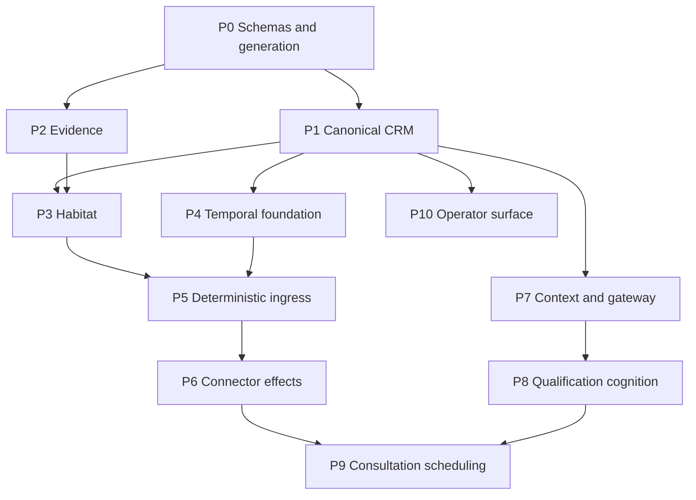

# Production Implementation Packet Index

**Revision:** 1  
**Governing baseline:** PRD 7.1 and Design-Truth Ledger 1  
**Purpose:** Dependency-bounded work packets for autonomous implementation agents

## 1. Packet completion rule

A packet is complete only when code, generated schemas, migrations, tests, evaluations where applicable, operational evidence, observability, rollback/recovery behavior, and affected documentation agree. An agent cannot weaken a gate, alter governing semantics, or declare completion from its own summary.

Every packet must emit:

- requirement and design-decision trace;
- changed-scope inventory;
- generated interface/schema compatibility report;
- deterministic test results;
- fault/replay results where applicable;
- security and secret-scan results;
- migration forward/rollback or forward-repair evidence;
- observability/alert evidence;
- applicable gate evidence; and
- independent completion reconstruction.

## 2. Dependency graph

## 3. Packet definitions

### PKT-00 — Schema generation and compatibility

**Objective:** Turn governing JSON/YAML contracts into generated application types, validators, migration inputs, and compatibility checks.

**Inputs:** `ONTOLOGY-V0.schema.json`, `COGNITIVE-RUNTIME-GATEWAY.schema.json`, `PRODUCTION-GATE-REGISTRY.yaml`.

**Must implement:**

- Draft 2020-12 structural validation;
- semantic validators for temporal ordering, proposal/action expiry, 14-day non-representation maximum, showing-only services, disposition/approval consistency, and digest formats;
- generated server/client types without hand-edited divergence;
- schema-version negotiation and unsupported-version failure;
- backward compatibility report and golden fixtures.

**Failure:** Invalid or unknown schema version fails before canonical mutation or runtime invocation.

**Evidence:** Schema compilation, valid/invalid fixture suite, generated-file drift check.

**Execution status (2026-08-18):** Implemented and locally verified. The verification record is
`PKT-00-VERIFICATION-REPORT.md`. Completion remains subject to repository CI reproducing the
recorded commands from a clean checkout.

### PKT-01 — PostgreSQL canonical CRM and ontology

**Objective:** Implement the canonical records and orthogonal state machines required by ontology v0 and OT-01.

**Dependencies:** PKT-00.

**Must implement:**

- tenant-scoped tables/repositories for Person, endpoint, BuyingParty, BuyerJourney, Conversation, Message, ConsentGrant, Suppression, QualificationObservation, Appointment, Commitment, PropertyReference, IABS, agreements, AgreementQualification, epistemic items, approvals, authorizations, and EffectAttempt;
- temporal validity, optimistic versions, supersession, contradiction, correction, source evidence, external identity mappings;
- deterministic identity-resolution locks;
- row-level/mandatory tenant query enforcement;
- migrations and rollback/forward-repair.

**Gates:** GATE-003, GATE-021, GATE-026.

**Evidence:** Reconstruction, concurrency, tenant-isolation, migration, and epistemic transition suites.

### PKT-02 — Evidence ledger and artifact boundary

**Objective:** Implement source artifacts, append-only material evidence, digests, hash links/checkpoints, retention classifications, and reconstruction APIs.

**Dependencies:** PKT-00.

**Must implement:**

- encrypted object references and digests;
- append-only evidence entries linked to canonical/workflow/effect identifiers;
- hash-chain/checkpoint verification;
- purpose-limited retrieval and redaction;
- deletion tombstones, legal hold, and derived-store invalidation events.

**Gates:** GATE-011, GATE-028; GATE-027 when derived memory activates.

**Evidence:** Tamper injection, artifact mismatch, reconstruction, retention, and deletion propagation tests.

### PKT-03 — Habitat admission and effect-permit service

**Objective:** Implement the independent deterministic authority boundary.

**Dependencies:** PKT-01, PKT-02.

**Must implement:**

- event-schema/tenant admission;
- policy and authority evaluation;
- DW2-C1 `EffectIntent`, current-state reload, resource locking, permit issue/redeem, and EffectAttempt registration;
- idempotency and permit replay rejection;
- approval, consent, representation, connector grant, proposal expiry, payload equality, and resource-version checks;
- `AgreementQualification` predicate and showing/offer hard stop;
- authority-decision evidence.

**Prohibited:** Signals, wakes, timers, workflow leases, retries, compensation, worker lifecycle, model calls, provider invocation.

**Gates:** GATE-004, GATE-006, GATE-018, GATE-029, GATE-033.

**Evidence:** Revocation/mutation races, expired approval/proposal, permit replay, agreement prerequisite and exception suites.

### PKT-04 — Temporal workflow foundation

**Objective:** Implement exclusive durable workflow ownership without business-truth or authority leakage.

**Dependencies:** PKT-01.

**Must implement:**

- BuyerJourneyWorkflow and child workflow skeletons;
- signals, wakes, timers, workflow/activity leases, retry/compensation/recovery, worker lifecycle;
- versioned workflow code and deterministic replay;
- canonical-state reconciliation activities;
- narrow concurrency keys and unknown-outcome states;
- no tenant-wide serialization.

**Gates:** GATE-002, GATE-010, GATE-025.

**Evidence:** Replay, crash, duplicate/reordered signal, workflow upgrade, and unknown-outcome fault suites.

### PKT-05 — Deterministic ingress, identity, consent, and acknowledgment

**Objective:** Activate the non-cognitive OT-01 ingress path.

**Dependencies:** PKT-01, PKT-02, PKT-03, PKT-04.

**Must implement:**

- form/email/SMS envelope adapters behind per-provider contracts;
- signature verification and event deduplication;
- canonical identity resolution and ambiguity cases;
- consent presentation evidence and suppression-first opt-out;
- deterministic template acknowledgment through Habitat/connector boundary;
- two-minute SLO metrics and attributable failures.

**Gates:** GATE-001, GATE-002, GATE-004, GATE-010, GATE-011, GATE-017, GATE-021, GATE-025, GATE-026, GATE-028, GATE-029, GATE-032, GATE-033.

**Activation block:** OPEN-001 and selected live ingress/sender configuration.

### PKT-06 — Governed connector gateway

**Objective:** Implement provider-neutral connector invocation that cannot bypass Habitat.

**Dependencies:** PKT-02, PKT-03, PKT-04.

**Must implement:**

- stable read/draft/effect interfaces;
- permit redemption before every provider-changing call;
- delegated identity/scopes, credential isolation, revocation;
- idempotency, conditional versions, receipts, delivery states, unknown-outcome reconciliation;
- webhook/change notification ingestion;
- live capability inventory.

**Gates:** GATE-002, GATE-010, GATE-011, GATE-015, GATE-016 when email/calendar enabled, GATE-018, GATE-029, GATE-033.

**Activation block:** OPEN-003 and provider-specific credentials/policy.

### PKT-07 — Context compiler and cognitive gateway foundation

**Objective:** Implement provider-neutral cognition without live buyer authority.

**Dependencies:** PKT-00, PKT-01, PKT-02.

**Must implement:**

- purpose/tenant/action-scoped context compiler;
- source/ontology/policy/knowledge manifests and freshness;
- gateway route, credential-reference, capability, capacity, adapter, normalization, proposal validation, expiry, evidence, and typed failures;
- no write-capable cognitive tools;
- Codex SDK and `codex exec` as distinct fixed transports; direct API/local interfaces;
- simulated adapters for deterministic contract tests only.

**Gates before live cognition:** GATE-008, GATE-013, GATE-014, GATE-017, GATE-019, GATE-021, GATE-022, GATE-023, GATE-024, GATE-035.

**Activation block:** OPEN-002 and OPEN-008 plus Gateway §18.

### PKT-08 — Progressive qualification cognition

**Objective:** Implement the bounded qualification proposal/action class against canonical state.

**Dependencies:** PKT-05, PKT-07.

**Must implement:**

- allowed qualification actions only;
- progressive question selection and approved knowledge answers;
- Assertion/Inference/Contradiction proposals with source links;
- deterministic admission and readiness predicate;
- fair-housing feature allowlist, prohibited-proxy compiler, minimum service guarantees, counterfactual/parity gates;
- deterministic degradation when cognition is unavailable.

**Gates:** GATE-003, GATE-007, GATE-008, GATE-013, GATE-014, GATE-019, GATE-022, GATE-023, GATE-024, GATE-035.

### PKT-09 — Consultation scheduling and reconciliation

**Objective:** Complete OT-01 with real calendar booking.

**Dependencies:** PKT-05, PKT-06, PKT-08.

**Must implement:**

- deterministic readiness and availability;
- short-lived SlotSet;
- slot communication through governed effect;
- booking/reschedule/cancel with current calendar versions, Habitat permits, provider receipts, and reconciliation;
- reminders and agent briefing;
- calendar conflict and unknown outcome recovery.

**Gates:** GATE-005 plus every dependency listed for GATE-005 and GATE-016.

**Activation block:** OPEN-003 and OPEN-006.

### PKT-10 — Operator exception and decision surface

**Objective:** Provide one Buyer Operations Agent surface over canonical state, decisions, evidence, and recovery.

**Dependencies:** PKT-01, PKT-02; incrementally integrates PKT-03–PKT-09.

**Must implement:**

- journey state, blockers, next action, commitments, qualification, consent, representation, appointment, and evidence views;
- approval/correction/revocation/pause controls within authority;
- identity, representation, connector, cognition, and workflow exceptions;
- no task dumping for routine autonomous work;
- full reason/evidence inspection without hidden chain-of-thought.

**Gates:** GATE-006, GATE-011, GATE-021, GATE-026, with WCAG 2.2 AA acceptance.

## 4. Activation sequence

1. Build and verify PKT-00 through PKT-04 with no live provider effects.
2. Activate PKT-05 only after its invariant and ingress gates pass with selected live channels.
3. Build PKT-06 with provider effects disabled, then activate each connector separately after its gates pass.
4. Build PKT-07 and PKT-08 in no-effect/shadow mode; activate substantive cognition only after route, corpus, capability, and evaluation decisions close.
5. Activate PKT-09 only after live calendar and consultation policy gates pass.
6. Extend the same production contracts to remaining specified capabilities; do not fork disposable architecture.

## 5. Release reconstruction

CI and deployment tooling must derive activation from the gate registry and immutable artifact/version references. A capability is active only when:

- configuration is complete;
- required packets are independently complete;
- all applicable gate evidence is current and passing;
- migrations and runtime versions match;
- provider identities/scopes read back correctly; and
- the activation decision is recorded with rollback state.

