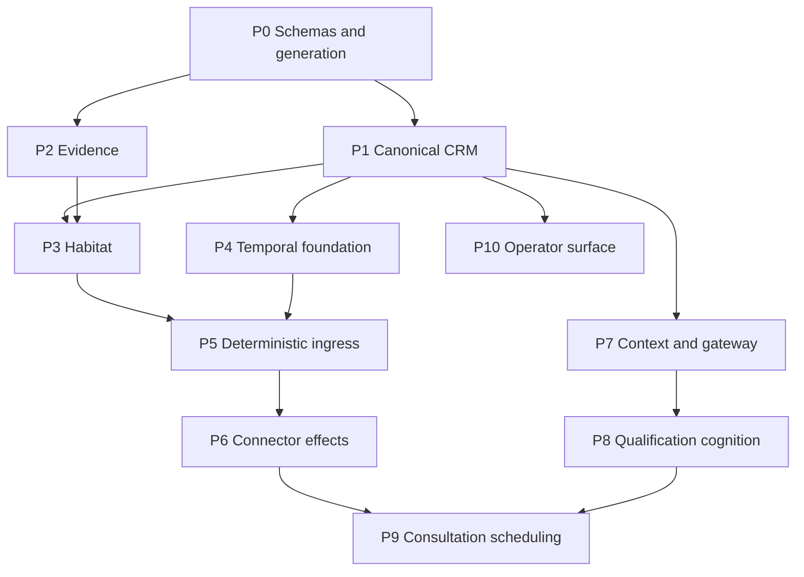

# Production Implementation Packet Index

**Revision:** 1  
**Governing baseline:** PRD 7.1 and Design-Truth Ledger 1  
**Purpose:** Dependency-bounded work packets for autonomous implementation agents

## 1. Packet completion rule

A packet is complete only when code, generated schemas, migrations, tests, evaluations where applicable, operational evidence, observability, rollback/recovery behavior, and affected documentation agree. An agent cannot weaken a gate, alter governing semantics, or declare completion from its own summary.

Every packet must emit:

- requirement and design-decision trace;
- changed-scope inventory;
- generated interface/schema compatibility report;
- deterministic test results;
- fault/replay results where applicable;
- security and secret-scan results;
- migration forward/rollback or forward-repair evidence;
- observability/alert evidence;
- applicable gate evidence; and
- independent completion reconstruction.

## 2. Dependency graph

## 3. Packet definitions

### PKT-00 — Schema generation and compatibility

**Objective:** Turn governing JSON/YAML contracts into generated application types, validators, migration inputs, and compatibility checks.

**Inputs:** `ONTOLOGY-V0.schema.json`, `COGNITIVE-RUNTIME-GATEWAY.schema.json`, `PRODUCTION-GATE-REGISTRY.yaml`.

**Must implement:**

- Draft 2020-12 structural validation;
- semantic validators for temporal ordering, proposal/action expiry, 14-day non-representation maximum, showing-only services, disposition/approval consistency, and digest formats;
- generated server/client types without hand-edited divergence;
- schema-version negotiation and unsupported-version failure;
- backward compatibility report and golden fixtures.

**Failure:** Invalid or unknown schema version fails before canonical mutation or runtime invocation.

**Evidence:** Schema compilation, valid/invalid fixture suite, generated-file drift check.

**Execution status (2026-08-19): Complete for SCP-01 admission.** Ontology `buyer-ops/0.3.0`
admits 40 roots, including executable connector-grant and confirmed-transaction-date semantics. All
11 contract families are hash-pinned, generated, fixture-tested, compatibility-declared, and pass the
full local gate chain recorded in `SPECIFICATION-CLOSURE-PACKET.md`.

### PKT-01 — PostgreSQL canonical CRM and ontology

**Objective:** Implement the canonical records and orthogonal state machines required by ontology v0 and OT-01.

**Dependencies:** PKT-00.

**Must implement:**

- tenant-scoped tables/repositories for Person, endpoint, BuyingParty, BuyerJourney, Conversation, Message, ConsentGrant, Suppression, QualificationObservation, Appointment, Commitment, PropertyReference, IABS, agreements, AgreementQualification, epistemic items, approvals, authorizations, and EffectAttempt;
- temporal validity, optimistic versions, supersession, contradiction, correction, source evidence, external identity mappings;
- deterministic identity-resolution locks;
- row-level/mandatory tenant query enforcement;
- migrations and rollback/forward-repair.

**Gates:** GATE-003, GATE-021, GATE-026.

**Evidence:** Reconstruction, concurrency, tenant-isolation, migration, and epistemic transition suites.

**Execution status (2026-08-19): Resumed against ontology 0.3.0.** The preserved local
suite and all 21 PostgreSQL integration tests pass through migration 0005, including reconstruction,
concurrency, tenant isolation, append-only history, supersession, identity resolution, typed-reference
resolution, nested/discriminated creator/attribution/actor/scope/party and canonical Evidence-source
reference binding, artifact-digest binding,
serialized active-representation cardinality, evidence, and
rollback refusal. Full PKT-01 completion
is not yet claimed because predicate-specific fact verification and atomic correction/contradiction
resolution now fail closed through governed verifiers and atomic repository admission. Local PKT-01
implementation gates pass; repository CI reproduction remains required for release closure.

OPEN-013 is resolved by canonical `ConfirmedTransactionDate`, typed same-tenant ownership,
confirmation-state, and source-digest admission rules in ontology 0.3.0.

### PKT-02 — Evidence ledger and artifact boundary

**Objective:** Implement source artifacts, append-only material evidence, digests, hash links/checkpoints, retention classifications, and reconstruction APIs.

**Dependencies:** PKT-00.

**Must implement:**

- encrypted object references and digests;
- append-only evidence entries linked to canonical/workflow/effect identifiers;
- hash-chain/checkpoint verification;
- purpose-limited retrieval and redaction;
- deletion tombstones, legal hold, and derived-store invalidation events.

**Gates:** GATE-011, GATE-028; GATE-027 when derived memory activates.

**Evidence:** Tamper injection, artifact mismatch, reconstruction, retention, and deletion propagation tests.

**Execution status (2026-08-19): Preserved and compatibility-admitted.** The packaged ontology
manifest pins 0.3.0; manifest/hash/generated-model checks and all 21 PostgreSQL tests pass. PKT-02
remains subject to its own activation gates but no longer blocks PKT-03 admission.

### PKT-03 — Habitat admission and effect-permit service

**Execution status (2026-08-19): Resumed; activation remains separately gated.** PKT-01 and PKT-02
compatibility admission passes against ontology 0.3.0. No PKT-03 service
or provider-effect activation is authorized until its own gates and repository CI pass. The first TDD
slices now provide a closed, hash-pinned and generated `EffectIntent` contract, authenticated tenant
admission, deterministic proposal-expiry and canonical-version rejection, current principal and scoped
authority checks, approval/payload binding, connector grant, suppression/consent evaluation,
fail-closed policy evaluation, and showing/offer qualification hard stops. Structured policy
dispositions with versioned `allowed`, `prohibited`, and `approval_required` outcomes are also
implemented. PostgreSQL resource/idempotency locking, internal single-use permit redemption,
authority-decision evidence, durable `EffectAttempt` registration, and replay denial pass locally.
Two-connection tests prove both observable canonical-version orderings, and target resource/version
binding is required to match the canonical vector exactly. Current active `WorkflowReference`
ownership is also required, with mismatches returning `concurrency_conflict` without assuming any
Temporal lease or scheduling responsibility.
OPEN-010 is resolved by canonical `ConnectorGrant` lifecycle, typed actor, scope/capability,
effective-time, revocation-evidence, version, and transactionally re-read admission semantics.

**Objective:** Implement the independent deterministic authority boundary.

**Dependencies:** PKT-01, PKT-02.

**Must implement:**

- event-schema/tenant admission;
- policy and authority evaluation;
- DW2-C1 `EffectIntent`, current-state reload, resource locking, permit issue/redeem, and EffectAttempt registration;
- idempotency and permit replay rejection;
- approval, consent, representation, connector grant, proposal expiry, payload equality, and resource-version checks;
- `AgreementQualification` predicate and showing/offer hard stop;
- authority-decision evidence.

**Prohibited:** Signals, wakes, timers, workflow leases, retries, compensation, worker lifecycle, model calls, provider invocation.

**Gates:** GATE-004, GATE-006, GATE-018, GATE-029, GATE-033.

**Evidence:** Revocation/mutation races, expired approval/proposal, permit replay, agreement prerequisite and exception suites.

### PKT-04 — Temporal workflow foundation

**Execution status (2026-08-18): In progress; no live worker activated.** Temporal Python SDK 1.30.0
and its transitive dependencies are pinned in `uv.lock`. A closed, generated OT-01 workflow contract
requires explicit runtime/retry configuration and mirrors the specified orthogonal journey view. The
first sandboxed `BuyerJourneyWorkflow` slice reconciles canonical state through an activity boundary,
deduplicates and ignores reordered canonical-change signals, rejects cross-scope signals, exposes a
queryable view, and replays its captured Temporal history deterministically. A fixed tenant/journey
workflow ID rejects duplicate starts, and a two-worker test proves the same execution resumes after
worker replacement. The first child, `ConnectorReconciliationWorkflow`, durably waits on configured
timers and reconciles `unknown_outcome` through a connector-owned activity until canonical state is
`reconciled_succeeded` or `reconciled_failed`; its history also replays. Qualification, nurture, and
consultation child skeletons now maintain only scoped, replay-safe canonical views and deliberately
make no business transition before their downstream packet contracts are implemented. A closed worker
configuration drives task queue, concurrency, cache, and graceful drain for a fixed sandboxed workflow
inventory. All five workflows use `PINNED` versioning; replay is required before explicit build
promotion. Fault tests prove explicit-policy activity retry and cancellation of an unresolved provider
outcome without false completion, repeat reconciliation, or fabricated compensation. Business-specific
compensation and live production worker deployment remain open.

**Execution status (2026-08-19): Resumed.** OPEN-014 is resolved by Temporal 1.1 compensation
commands/results with eligibility, expected effect version, Habitat permit, authorization,
idempotency, expiry, outcome, retry, and evidence bindings. PKT-04 implementation is not represented
as complete. A validated Temporal activity boundary now delegates the published command unchanged to
an injected compensation executor, validates the published result, and rejects command/effect binding
mismatches. Connector-specific compensation behavior, retry disposition, and operational thresholds
remain owned by their governing downstream contracts and configuration; Temporal does not invent them.

**Objective:** Implement exclusive durable workflow ownership without business-truth or authority leakage.

**Dependencies:** PKT-01.

**Must implement:**

- BuyerJourneyWorkflow and child workflow skeletons;
- signals, wakes, timers, workflow/activity leases, retry/compensation/recovery, worker lifecycle;
- versioned workflow code and deterministic replay;
- canonical-state reconciliation activities;
- narrow concurrency keys and unknown-outcome states;
- no tenant-wide serialization.

**Gates:** GATE-002, GATE-010, GATE-025.

**Evidence:** Replay, crash, duplicate/reordered signal, workflow upgrade, and unknown-outcome fault suites.

### PKT-05 — Deterministic ingress, identity, consent, and acknowledgment

**Execution status (2026-08-19): In progress; no governing-contract block.** OPEN-011 is resolved by the closed,
versioned OT-01 ingress contract and fixtures. OPEN-027 and OT-01 Ingress Contract 1.1 with
`OT01-INGRESS.schema.json` govern deterministic opt-out recognition, acknowledgment policy and
selection, immutable template/substitution boundaries, suppression-first atomicity, attributable
outcomes, expiry, idempotency, typed failure, and 1.0-to-1.1 compatibility. Existing
identity-resolution and evidence work remains preserved. Provider-neutral envelope validation,
injected destination/signature authentication, artifact-digest verification, and an append-only
tenant-RLS exact provider-event replay registry pass unit and PostgreSQL reconstruction tests.
OPEN-019 is resolved by closure 1.1.0. The runtime deduplicates on tenant, connector, provider
account, and stable external message ID across changing event IDs; digest conflicts are persisted and
enter `reconciliation_required`. PKT-05 may resume against the published 1.1.0 contract. Live
acknowledgment remains activation-blocked by OPEN-001 and selected sender/ingress configuration and
must traverse Habitat and connector permit redemption.

**Objective:** Activate the non-cognitive OT-01 ingress path.

**Dependencies:** PKT-01, PKT-02, PKT-03, PKT-04.

**Must implement:**

- form/email/SMS envelope adapters behind per-provider contracts;
- signature verification and event deduplication;
- canonical identity resolution and ambiguity cases;
- consent presentation evidence and suppression-first opt-out;
- deterministic template acknowledgment through Habitat/connector boundary;
- two-minute SLO metrics and attributable failures.

**Gates:** GATE-001, GATE-002, GATE-004, GATE-010, GATE-011, GATE-017, GATE-021, GATE-025, GATE-026, GATE-028, GATE-029, GATE-032, GATE-033.

**Activation block:** OPEN-001 and selected live ingress/sender configuration.

### PKT-06 — Governed connector gateway

**Objective:** Implement provider-neutral connector invocation that cannot bypass Habitat.

**Dependencies:** PKT-02, PKT-03, PKT-04.

**Must implement:**

- stable read/draft/effect interfaces;
- permit redemption before every provider-changing call;
- delegated identity/scopes, credential isolation, revocation;
- idempotency, conditional versions, receipts, delivery states, unknown-outcome reconciliation;
- webhook/change notification ingestion;
- live capability inventory.

**Gates:** GATE-002, GATE-010, GATE-011, GATE-015, GATE-016 when email/calendar enabled, GATE-018, GATE-029, GATE-033.

**Activation block:** OPEN-003 and provider-specific credentials/policy.

**Execution status (2026-08-19): Eligible in dependency order.** OPEN-015 is resolved by connector
gateway 1.0 request, response, change-event, capability/grant, delegated-identity, revocation,
receipt, conditional-version, and reconciliation bindings. Provider-neutral request/response
validation, current grant injection, credential-isolated adapter invocation, payload digest checks,
and mandatory matching redeemed Habitat permits for changing capabilities now pass locally. OPEN-020
is resolved by closure 1.1.0: signed current inventories, capability/action/constraint mappings,
inventory/grant/principal/idempotency-bound previews, execution windows, and permit matching are
enforced. PKT-06 remains in progress for provider-specific adapters and live connector evidence.

### PKT-07 — Context compiler and cognitive gateway foundation

**Execution status (2026-08-18): In progress; cognition remains inactive.** The previously absent
machine contract for context compilation is now closed, hash-pinned, packaged, generated, and
drift-checked. It defines tenant/principal/journey/workflow/action/purpose-scoped compile requests,
ontology/policy/knowledge/compiler versions, source record versions and digests, explicit exclusion
reasons, packet digest, Ed25519 manifest signature, and typed `context_insufficient` failure. The
deterministic compiler and gateway admission boundary bind tenant, principal, buyer journey, workflow,
action class, signed source identity/content, ontology version, and freshness before cognition. Closed
runtime-control contracts now cover route policies, opaque credential identities, capability profiles,
and durable typed failures. Fixed-route eligibility, authorized transitions with context recompilation,
atomic test capacity leases, simulated subscription/API/local adapters, authoritative runtime evidence,
provider-error normalization, and proposal grounding/freshness admission are implemented. Production credential brokers, durable
capacity backends, real provider adapters, degradation, and the remaining output-safety gates remain open.

**Objective:** Implement provider-neutral cognition without live buyer authority.

**Dependencies:** PKT-00, PKT-01, PKT-02.

**Must implement:**

- purpose/tenant/action-scoped context compiler;
- source/ontology/policy/knowledge manifests and freshness;
- gateway route, credential-reference, capability, capacity, adapter, normalization, proposal validation, expiry, evidence, and typed failures;
- no write-capable cognitive tools;
- Codex SDK and `codex exec` as distinct fixed transports; direct API/local interfaces;
- simulated adapters for deterministic contract tests only.

**Gates before live cognition:** GATE-008, GATE-013, GATE-014, GATE-017, GATE-019, GATE-021, GATE-022, GATE-023, GATE-024, GATE-035.

**Activation block:** OPEN-002 and OPEN-008 plus Gateway §18.

OPEN-012 is resolved by gateway-runtime 1.1 context-sufficiency, action/output-safety, and
deterministic-degradation policy records. PKT-07 resumes; live cognition still requires its named
activation decisions and gates. OPEN-021 is resolved by Context Compiler and closure 1.1.0. Signed
manifests now bind one current action/output mapping plus each source's observation, freshness window,
epistemic type, and governed stale label. PKT-07 remains in progress for production cognitive routes,
credentials, capacity, and its named activation gates.

### PKT-08 — Progressive qualification cognition

**Execution status (2026-08-19): In progress; no governing-contract block.** Qualification Readiness
Contract 1.0 publishes owner-bound policy, exact criterion/freshness/disposition inputs,
deterministic question tie-breaking, exact service-zone/capacity/escalation bindings, typed input
sets, and source-linked derivation decisions. Implementation may resume against
`QUALIFICATION-READINESS.schema.json`; production cognition remains subject to the named gates and
OPEN-002/OPEN-008 activation inputs.

**Objective:** Implement the bounded qualification proposal/action class against canonical state.

**Dependencies:** PKT-05, PKT-07.

**Must implement:**

- allowed qualification actions only;
- progressive question selection and approved knowledge answers;
- Assertion/Inference/Contradiction proposals with source links;
- deterministic admission and readiness predicate;
- fair-housing feature allowlist, prohibited-proxy compiler, minimum service guarantees, counterfactual/parity gates;
- deterministic degradation when cognition is unavailable.

**Gates:** GATE-003, GATE-007, GATE-008, GATE-013, GATE-014, GATE-019, GATE-022, GATE-023, GATE-024, GATE-035.

### PKT-09 — Consultation scheduling and reconciliation

**Execution status (2026-08-19): In progress; no governing-contract block.** Availability and Booking
Contract 1.0 publishes owner-bound provider/calendar and availability policy, exact snapshot and
watermark bindings, deterministic SlotSet derivation/ordering/expiry, book/reschedule/cancel
commands, provider results, and unknown-outcome reconciliation. Implementation may resume against
`AVAILABILITY-BOOKING.schema.json`; live calendar effects remain blocked by OPEN-003/OPEN-006 and
the named gates.

**Objective:** Complete OT-01 with real calendar booking.

**Dependencies:** PKT-05, PKT-06, PKT-08.

**Must implement:**

- deterministic readiness and availability;
- short-lived SlotSet;
- slot communication through governed effect;
- booking/reschedule/cancel with current calendar versions, Habitat permits, provider receipts, and reconciliation;
- reminders and agent briefing;
- calendar conflict and unknown outcome recovery.

**Gates:** GATE-005 plus every dependency listed for GATE-005 and GATE-016.

**Activation block:** OPEN-003 and OPEN-006.

### PKT-10 — Operator exception and decision surface

**Objective:** Provide one Buyer Operations Agent surface over canonical state, decisions, evidence, and recovery.

**Dependencies:** PKT-01, PKT-02; incrementally integrates PKT-03–PKT-09.

**Must implement:**

- journey state, blockers, next action, commitments, qualification, consent, representation, appointment, and evidence views;
- approval/correction/revocation/pause controls within authority;
- identity, representation, connector, cognition, and workflow exceptions;
- no task dumping for routine autonomous work;
- full reason/evidence inspection without hidden chain-of-thought.

**Gates:** GATE-006, GATE-011, GATE-021, GATE-026, with WCAG 2.2 AA acceptance.

**Execution status (2026-08-19): In progress; no governing-contract block.** OPEN-017 is resolved by operator
surface 1.0 read models, commands, typed errors, authority/concurrency/offline bindings,
exception/recovery evidence, and WCAG 2.2 AA acceptance records. The first command-service slice
validates command/target compatibility, exact payload digest, issue/expiry window, freshly injected
authority, idempotency digest equality, optimistic target version, and bound result records. Offline
commands traverse the same admission seam and receive no separate authority path. OPEN-028 is
resolved by Operator Surface 1.1.0: complete caller-supplied ontology mutation records, versioned
owner-supplied policy, exact authorization scope, payload binding, and atomic canonical/result
persistence pass locally, including forced result-persistence rollback. Views, accessibility build
admission, exception integration, and application surfaces remain open.

## 4. Activation sequence

1. Build and verify PKT-00 through PKT-04 with no live provider effects.
2. Activate PKT-05 only after its invariant and ingress gates pass with selected live channels.
3. Build PKT-06 with provider effects disabled, then activate each connector separately after its gates pass.
4. Build PKT-07 and PKT-08 in no-effect/shadow mode; activate substantive cognition only after route, corpus, capability, and evaluation decisions close.
5. Activate PKT-09 only after live calendar and consultation policy gates pass.
6. Extend the same production contracts to remaining specified capabilities; do not fork disposable architecture.

## 5. Release reconstruction

CI and deployment tooling must derive activation from the gate registry and immutable artifact/version references. A capability is active only when:

- configuration is complete;
- required packets are independently complete;
- all applicable gate evidence is current and passing;
- migrations and runtime versions match;
- provider identities/scopes read back correctly; and
- the activation decision is recorded with rollback state.

OPEN-016 is resolved by release-activation 1.0 gate-evidence and activation-decision records.
OPEN-018 is resolved by telemetry/SLO 1.0 and its versioned catalog. Live activation still requires
current evidence instances and an authorized activation decision; schema publication alone does not
activate a capability.
