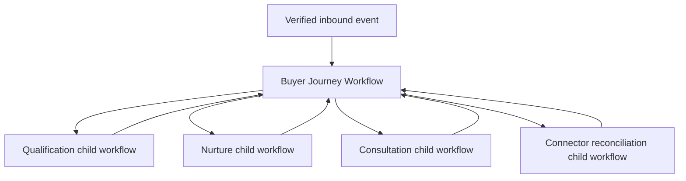

# Operational Thread 01: Lead to Consultation Contract

**Contract ID:** `OT-01`  
**Revision:** 1  
**Status:** Governing production operational-thread contract  
**Journey span:** Inbound lead/form → canonical identity → consent/contactability → deterministic acknowledgment → progressive qualification → consultation readiness → real calendar booking and reconciliation

## 1. Objective

Every legitimate inbound buyer opportunity entering an enabled channel becomes durable, correctly identified, immediately acknowledged within policy, progressively qualified, and either booked for a real consultation or placed in an explicit nurture, blocked, suppressed, released, or escalation state. No event, commitment, consent change, booking, or provider result disappears or completes from intent alone.

This is production behavior. It uses the final canonical, authority, evidence, workflow, connector, context, and cognitive boundaries.

## 2. Scope

### Included

- Product-owned branded forms and referral forms
- Enabled inbound email and SMS entry points
- Provider webhook/event verification and durable capture
- Canonical Person, BuyingParty, BuyerJourney, Conversation, and attribution creation/resolution
- Consent, suppression, contactability, and operating-hours enforcement
- Deterministic receipt acknowledgment
- Cognitive or deterministic progressive qualification
- Consultation-readiness computation
- Calendar availability, slot offer, booking, reschedule, cancellation, reminders, and reconciliation
- Agent briefing and exception/decision surface
- Failure, degradation, replay, revocation, and recovery

### Excluded from this thread

- Property search, matching, ranking, listing status, CMA, or autonomous showing selection
- Buyer agreement execution and showing/offer prerequisites, except detecting that later workflows remain unavailable
- Paid campaign publishing
- Outbound AI-generated voice
- Contract/transaction deadline coordination

Exclusion from OT-01 does not remove these capabilities from the complete product.

## 3. Activation prerequisites

| Requirement | Required before live activation |
|---|---|
| Customer authority | Initial broker/sponsored-agent decision and approved communications/automation policy |
| Service configuration | Operating hours, quiet hours, service zones, capacity, languages, escalation contacts |
| Ingress | At least one live authorized form, email, or SMS source with webhook verification |
| Outbound acknowledgment | Approved channel templates and sender identity |
| Calendar | Selected provider, OAuth/service identity, consultation types, locations, buffers, availability |
| Cognition | Required only for cognitive qualification: route matrix, corpus, capability profile, Gateway §18 qualification |
| Gates | All applicable PI gates plus OT ingress, qualification, and consultation-scheduling gates |

Without live cognition, the thread may activate only deterministic capture, identity, consent/opt-out, acknowledgment, queueing, and operator-visible follow-up states. It must not produce substantive cognitive answers.

## 4. Component ownership

| Concern | Owner |
|---|---|
| Canonical person/journey/conversation/consent/qualification/appointment state | PostgreSQL services |
| Provider events and durable workflow | Temporal |
| Event schema/tenant admission and every external effect permit | Habitat |
| Deterministic acknowledgment selection | Communications policy service |
| Context assembly | Context compiler |
| Qualification proposal | Cognitive Runtime Gateway or deterministic rules where declared |
| Email/SMS/calendar provider invocation | Connector gateway |
| Evidence artifacts | Evidence ledger and object storage |
| Agent exception and decision display | Operator surface |

## 5. Durable workflow topology



- One long-lived `BuyerJourneyWorkflow` exists per BuyerJourney.
- Provider events signal the workflow after durable event admission.
- Temporal owns signals, timers, activity leases, retries, compensation, recovery, and child lifecycle.
- Temporal search attributes are execution indexes, not business truth.
- Workflow code reads/writes canonical state through versioned activities and never stores the only copy of a fact or commitment.

## 6. Ingress contract

### 6.1 `InboundEnvelope`

```ts
interface InboundEnvelope {
  schemaVersion: "ot01.inbound/1";
  providerEventId: string;
  providerAccountRef: string;
  channel: "form" | "email" | "sms";
  receivedAt: string;
  providerOccurredAt?: string;
  senderEndpoint: string;
  recipientEndpoint: string;
  externalThreadId?: string;
  replyToMessageId?: string;
  payloadArtifactId: string;
  payloadDigest: string;
  signatureVerification: "verified" | "not_supported";
  attribution?: AttributionInput;
  consentPresentation?: ConsentPresentationEvidence;
}
```

Admission requirements:

1. Validate tenant connector binding and destination endpoint.
2. Verify webhook signature when supported; `not_supported` requires the approved compensating control.
3. Register `(tenantId, providerAccountRef, providerEventId)` idempotently before processing.
4. Store raw payload in retention-governed object storage and write evidence digest.
5. Reject cross-tenant or unknown-destination events without exposing tenant data.
6. Acknowledgment SLO begins at verified durable capture, not at cognitive processing.

### 6.2 Duplicate and reorder behavior

- Exact duplicate: link to the original admitted event and perform no repeated domain or external effect.
- Same provider message under a different event ID: deduplicate by stable external message ID and digest.
- Reordered event: apply only if its provider version/time and domain transition are valid; otherwise retain as late evidence without regressing state.
- Provider resend after unknown acknowledgment outcome: reconcile the prior `EffectAttempt` before a new send.

## 7. Identity-resolution contract

### 7.1 Resolution inputs

- normalized and verified email/phone endpoint;
- provider contact/account identity;
- reply/thread lineage;
- explicit form identity fields;
- existing external identity mappings;
- tenant and purpose scope.

Names, inferred household similarity, semantic resemblance, or model judgment alone cannot merge people.

### 7.2 Resolution outcomes

| Outcome | Behavior |
|---|---|
| `matched` | Attach event to one canonical Person with version evidence |
| `created` | Create Person, endpoint, BuyingParty, BuyerJourney, Conversation, and attribution atomically |
| `ambiguous` | Create `IdentityResolutionCase`; do not merge; continue only endpoint-safe acknowledgment/policy behavior |
| `conflict` | Block material mutations and surface reconciliation |
| `suppressed` | Record inbound evidence; enforce suppression; send only legally/policy-permitted opt-out confirmation if applicable |

### 7.3 Concurrency

Resolution is serialized on normalized endpoint/external identity using a PostgreSQL advisory/row key or serializable transaction. Concurrent first contacts must produce one canonical endpoint mapping and at most one new active journey per declared journey-resolution policy.

## 8. Consent, contactability, and acknowledgment

### 8.1 Consent rules

- Form consent is created only from the exact versioned language and affirmative event presented.
- Inbound email/SMS response authority is determined by configured brokerage/channel policy and applicable law; the system does not invent broad marketing consent from an inbound inquiry.
- Consent is scoped by person/endpoint, channel, purpose, tenant/principal, and effective interval.
- Active suppression dominates consent.
- STOP and equivalent configured opt-out expressions are detected deterministically before cognition and write suppression synchronously.

### 8.2 Deterministic acknowledgment

The acknowledgment path contains no model call. It may:

- confirm receipt;
- identify the automated assistant and responsible agent/brokerage;
- state configured operating-hour expectations;
- acknowledge opt-out or routing status;
- provide a fixed next-step link or request one approved identity field; and
- create durable follow-up work.

It may not answer substantive real-estate, property, agreement, financing, legal, tax, inspection, or scheduling questions unless the answer is a deterministic authoritative value explicitly approved for the template.

### 8.3 Acknowledgment effect

1. Select approved template by channel, language, operating-hour state, contactability, and inbound purpose.
2. Construct exact recipient, sender, payload, purpose, expiry, and idempotency key.
3. Invoke Habitat DW2-C1 immediately before send.
4. Connector gateway redeems the single-use permit and invokes provider.
5. Persist accepted/delivered/failed/unknown receipt.
6. Reconcile unknown outcome before retry.

Target: 95% within two minutes from verified durable capture when the channel and service are enabled. The remaining 5% must be attributable to an explicit failure state, not missing telemetry.

## 9. Buyer Journey Workflow state

```ts
interface OT01JourneyState {
  journeyId: string;
  canonicalVersion: number;
  ingressState: "captured" | "identified" | "identity_ambiguous" | "rejected";
  contactabilityState: "unknown" | "contactable" | "temporarily_unavailable" | "suppressed" | "invalid";
  acknowledgmentState: "not_required" | "pending" | "sent" | "delivered" | "failed" | "unknown_outcome";
  qualificationState: "not_started" | "collecting" | "sufficient_for_consult" | "stale" | "contradicted" | "declined";
  consultationState: "not_ready" | "ready" | "offering" | "provider_pending" | "booked" | "completed" | "cancelled" | "no_show" | "blocked";
  nurtureState: "inactive" | "active" | "paused" | "dormant" | "completed";
  blockerCodes: string[];
  nextDueAt?: string;
}
```

This is a workflow view over canonical state. On replay or mismatch, canonical PostgreSQL state wins and the workflow reconciles its execution plan.

## 10. Progressive qualification contract

### 10.1 Allowed qualification criteria

The versioned brokerage policy selects criteria from ontology v0, including:

- identity/contactability;
- existing representation;
- purchase intent and reason for moving;
- buyer-stated target geography;
- buyer-stated property characteristics;
- timing/readiness;
- budget range and financing readiness;
- housing/sale contingency;
- decision participants;
- scheduling constraints;
- preferred channel/frequency; and
- information blocking a productive consultation.

Protected characteristics and prohibited proxies are absent from the feature/tool surface.

### 10.2 `QualificationProposal`

Qualification cognition returns a `CognitiveProposal` whose allowed actions are limited to:

- `answer_from_approved_knowledge`;
- `ask_qualification_question`;
- `acknowledge_buyer_statement`;
- `propose_qualification_observation`;
- `identify_contradiction_or_unknown`;
- `propose_consultation_readiness`; and
- `escalate_exception`.

It cannot propose property recommendations, steering, legal interpretation, agreement terms, offer creation, external writes, or fact verification from model opinion.

### 10.3 Observation admission

- Direct buyer statement becomes `Assertion` with message/source span.
- Deterministically verified endpoint/provider fact may become `VerifiedFact` under its predicate rule.
- A cognitive interpretation becomes `Inference` with inputs, confidence, expiry, and cannot replace the underlying assertion.
- Contradictions remain unresolved until evidence or authorized clarification resolves them.
- Unknown, buyer-declined, stale, and not-applicable remain distinct.

### 10.4 Context sufficiency

Every qualification action requires:

- tenant/agent/broker policy versions;
- current person, journey, conversation, consent, representation, and prior qualification state;
- source-linked recent messages;
- allowed knowledge versions;
- operating-hour/channel policy;
- current open commitments and unresolved contradictions; and
- action-class compiled read/draft-only tools.

Failure enters `context_insufficient`; it does not fabricate a question or answer.

## 11. Consultation-readiness predicate

`ConsultationReady(journey, policy, at)` is deterministic and versioned. It requires:

- resolved or policy-permitted identity state;
- contactable and not suppressed;
- known representation status without unresolved conflict;
- minimum configured intent, geography/service fit, timing, budget/financing readiness state, and decision-participant information;
- all policy-required blockers answered, declined where permissible, or explicitly marked for agent handling;
- no urgent legal/safety/hostility/escalation state requiring separate handling; and
- available agent capacity under current service-zone and consultation policy.

The cognitive runtime may propose readiness and explain evidence. It cannot set readiness directly.

## 12. Consultation scheduling contract

### 12.1 Availability read

- Read current calendar through the selected connector.
- Apply consultation type, duration, buffers, travel/location, service zone, working hours, blackout, capacity, and time-zone policy.
- Generate a short-lived `SlotSet` with calendar version/watermark and expiry.
- Do not expose private calendar event content to the buyer.

### 12.2 Slot offer

An outbound slot offer is an external communication and follows DW2-C1. The payload identifies the exact slots, time zone, location/mode, expiry, and rescheduling policy.

### 12.3 Booking

```ts
interface BookingIntent {
  bookingIntentId: string;
  tenantId: string;
  journeyId: string;
  buyerPartyId: string;
  appointmentType: string;
  selectedSlotId: string;
  slotSetVersion: string;
  calendarBindingId: string;
  calendarVersion: string;
  participants: string[];
  locationOrMode: string;
  payloadDigest: string;
  idempotencyKey: string;
  expiresAt: string;
}
```

Booking steps:

1. Re-read or conditionally reserve the selected slot.
2. Validate current consent/contactability, readiness, policy, participant identities, calendar grant, slot expiry, and calendar version.
3. Obtain and redeem Habitat permit.
4. Create provider event with idempotency and version preconditions.
5. Persist `provider_pending` until an authoritative provider ID/response exists.
6. Confirm canonical Appointment only from provider acceptance/readback.
7. Signal journey and reminder workflows.

Conflict or stale slot returns new availability; it does not double-book or silently choose another time.

### 12.4 Reschedule/cancel

Reschedule and cancel are separate provider-changing intents with current appointment version, participant authority, payload digest, idempotency, and Habitat permit. Unknown outcomes reconcile before another operation.

## 13. Agent briefing and exception surface

Before a booked consultation, the system compiles a briefing containing:

- buyer and participant identity;
- lead source and attribution;
- known, asserted, inferred, contradicted, stale, declined, and unknown qualification items;
- representation status;
- stated geography/property needs without demographic interpretation;
- financing-readiness state with verification level;
- commitments, unresolved questions, risks, and requested agent decisions;
- consultation logistics and provider-confirmed appointment; and
- source links for every material statement.

Exceptions requiring the operator surface include identity conflict, representation conflict, urgent/legal/safety concerns, repeated delivery failure, connector revocation, booking conflict, context insufficiency, unsupported question, and policy-denied action.

## 14. Concurrency and ordering

| Resource | Serialization/ordering key |
|---|---|
| Provider event | tenant + provider account + event/message ID |
| Endpoint identity | tenant + normalized endpoint/external identity |
| Conversation send order | tenant + conversation ID |
| Consent/suppression | tenant + person/endpoint + channel + purpose |
| Qualification observation | journey + criterion + applicable interval |
| Calendar event | connector binding + provider event ID/version |
| Effect admission | action-specific resource lock/version vector under DW2-C1 |

There is no tenant-wide run lock. Independent journeys execute concurrently.

## 15. Failure taxonomy and recovery

| Failure | Durable state | Recovery |
|---|---|---|
| Invalid webhook/authenticity | `event_rejected` | Retain minimal security evidence; do not process |
| Identity ambiguity | `identity_ambiguous` | Endpoint-safe ack; operator or deterministic resolution |
| Suppressed contact | `suppressed` | No prohibited outbound; inbound evidence retained |
| Connector auth revoked | `blocked_connector_auth` | Reauthorize; revalidate current state before resume |
| Provider timeout | `unknown_outcome` | Reconcile before retry |
| Cognitive auth/capacity | `blocked_auth` / `blocked_capacity` | Authorized route transition or deterministic degradation |
| Context insufficiency | `context_insufficient` | Acquire permitted evidence or escalate |
| Schema/grounding rejection | `proposal_rejected` | Retry within policy or escalate; no state/effect |
| Slot/calendar conflict | `calendar_conflict` | Refresh and offer new slots |
| Policy/authority denial | `policy_denied` | Surface reason; no effect; policy change only through authorized process |
| Workflow crash/replay | execution recovery | Temporal replay; reconcile canonical state and effects |

## 16. Observability

Per journey, expose:

- current orthogonal states and canonical versions;
- last verified inbound event and acknowledgment status;
- consent/suppression status and source;
- qualification completeness, contradictions, and freshness;
- next due action and Temporal workflow reference;
- cognitive route/state when applicable;
- current blockers and recovery owner;
- proposed/confirmed appointment and provider version;
- every external effect attempt, permit decision, and provider receipt; and
- attributable funnel/source metrics.

Required metrics include capture latency, acknowledgment latency, identity ambiguity rate, duplicate suppression, qualification completion, consult readiness, slot conversion, booking conflict, provider unknown outcome, connector/cognitive blocked time, opt-out, complaint, fair-housing parity, and agent exception load.

## 17. Gate mapping

### Required platform invariants

`GATE-002`, `GATE-004`, `GATE-006`, `GATE-007`, `GATE-008`, `GATE-010`, `GATE-011`, `GATE-017`, `GATE-018`, `GATE-021`, `GATE-023`, `GATE-025`, `GATE-026`, `GATE-028`, `GATE-029`, `GATE-032`, `GATE-033`

### Operational-thread gates

- Ingress: `GATE-001`
- Qualification: `GATE-003`
- Consultation scheduling: `GATE-005`

### Capability gates when enabled

- Cognition: `GATE-013`, `GATE-014`, `GATE-019`, `GATE-022`, `GATE-024`, `GATE-035`
- Email/calendar connector: `GATE-015`, `GATE-016`
- Conversation memory: `GATE-020`
- Semantic memory/Neo4j when used: `GATE-027`, `GATE-034`

## 18. Acceptance scenarios

1. Concurrent duplicate form submissions produce one person/journey and one acknowledgment effect.
2. A known person using a new unverified endpoint is not silently merged without an allowed identity transition.
3. Ambiguous identity receives only endpoint-safe handling and cannot expose an existing buyer record.
4. STOP arriving concurrently with a scheduled send commits suppression first or produces an attributable ordering under which no later prohibited effect is admitted.
5. A cognition outage still durably captures, acknowledges, suppresses, preserves deadlines, and queues substantive work.
6. A buyer correction after compaction invalidates the old value and appears correctly in the next context and briefing.
7. A buyer with contradictory representation statements cannot become consultation-ready until policy permits explicit agent resolution.
8. Protected-trait or prohibited-proxy injection cannot influence priority, cadence, slot availability, service level, or escalation.
9. A cognitive proposal with an unsupported claim, prohibited action, missing source, or expired action is rejected.
10. A stale calendar slot cannot be booked; the buyer receives a governed refreshed offer without duplicate events.
11. Provider timeout followed by late success reconciles the original booking and never creates a second event.
12. Connector revocation after slot selection but before booking blocks the write and exposes the blocked workflow.
13. Approval or payload mutation after workflow admission but before an approval-bound effect causes Habitat denial.
14. Workflow replay after confirmed booking reconstructs the same Appointment and performs no duplicate send or booking.
15. Agent briefing labels every material item by epistemic state and source and includes no unsupported property claim.
16. Every enabled inbound channel meets the two-minute acknowledgment SLO at the required percentile or exposes an attributable failure record.
17. End-to-end live execution traces one lead through canonical identity, qualification, readiness, provider-confirmed booking, evidence, and operator briefing.

## 19. Completion evidence

OT-01 is activatable only when the repository contains generated schemas and migrations, workflow/activity implementations, Habitat and connector contracts, deterministic and model evaluations, live connector test evidence, replay/fault results, observability dashboards/alerts, production configuration readback, gate decisions, and an independent completion ledger mapping every section above to code and evidence.

