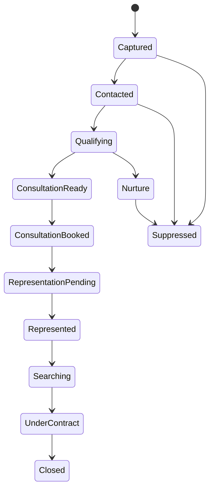

# Product Requirements: Autonomous Buyer Agent Operations System

**Status:** Product definition baseline, Revision 7.1  
**Market:** Texas, United States  
**Primary customer:** Independent residential real estate agent  
**Primary outcome:** More closed buyer transactions  
**Initial property-data constraint:** No MLS, IDX, or licensed property-data integration  
**Required cognitive architecture:** Product-owned Cognitive Runtime Gateway supporting explicitly authorized subscription, API, workspace/service-account, and local-model adapters

## 1. Product definition

The product is an autonomous operating system for the non-property-search work of residential buyer representation. It continuously acquires, responds to, qualifies, nurtures, and converts buyer prospects; coordinates the operational buyer journey; maintains CRM truth; and brings the licensed agent into the process only when licensed judgment, a consequential commitment, or an explicit approval is required.

It is not a chatbot attached to a CRM. It is a durable operating agent with goals, policies, memory, tools, work queues, event-driven follow-up, outcome verification, and a complete record of what it observed, decided, communicated, and changed.

The reasoning system must be model- and provider-replaceable behind a product-owned Cognitive Runtime Gateway. Subscription-backed agent runtimes, metered APIs, workspace or service-account identities, and approved local endpoints are distinct runtime classes that consume the same versioned cognitive request and return the same schema-validated proposal. Routing and fallback are explicit configuration by tenant and action class; the system must never silently change provider, identity, authentication class, billing class, or evaluated model family. Durable business state, timers, event ingestion, authorization, connector execution, and evidence remain product-owned so that no model thread, agent session, subscription credential, or provider API is the system of record.

Because the initial release has no property inventory integration, it does not search listings, recommend homes, calculate comparative market analyses, or autonomously schedule property-specific showings. A property may be attached manually by the agent or buyer so that the system can coordinate downstream work, but the system must not claim that its view of inventory is complete or current.

### Product promise

> Every legitimate buyer opportunity receives an immediate, relevant response and persistent, policy-compliant follow-through until it closes, opts out, becomes ineligible, or is deliberately released by the agent.

## 2. Users and roles

| Role | Needs | Product responsibility |
|---|---|---|
| Independent agent | More closings without carrying the administrative and follow-up load | Operate the buyer pipeline, surface decisions, and preserve agent attention for licensed work |
| Buyer prospect | Fast, useful, consistent help without spam or deception | Respond transparently, remember context, qualify needs, schedule the agent, and respect consent |
| Sponsoring broker or compliance reviewer | Brokerage-policy and regulatory conformance | Provide policy controls, communications evidence, approval records, and exportable audit history |
| Transaction participant | Timely requests and clear milestone coordination | Coordinate only within the buyer's and agent's granted authority |

The primary operator is the independent agent. The product must nevertheless support sponsoring-broker policies because a Texas sales agent cannot define an authority boundary independently of the broker under whom the agent operates.

## 3. Business objective and measurement

### North-star metric

**Closed buyer transactions per active agent per rolling 180 days**, segmented by lead source and normalized by marketing spend.

The product succeeds only when it creates an attributable lift in closings. Message volume, generated content, tasks completed, and leads scored are operational metrics, not business success.

### Required funnel measurements

1. New identifiable prospects acquired.
2. Median inbound first-response time.
3. Contacted prospects who complete qualification.
4. Qualified prospects who book a consultation.
5. Consultations that occur.
6. Prospects who sign a buyer-representation agreement.
7. Represented buyers who enter contract.
8. Contracts that close.
9. Agent labor minutes per closed buyer transaction.
10. Acquisition and operating cost per closing.

### Initial outcome targets

Targets must be calibrated against the agent's prior 180-day funnel before activation. The production acceptance target is:

- at least **20% relative improvement in qualified-prospect-to-consultation conversion** within 90 days;
- at least **15% relative improvement in consultation-to-signed-representation conversion** within 180 days;
- a positive lift in closed buyer transactions over the first comparable 180-day period, without increasing total cost per closing; and
- no material degradation in opt-out, complaint, fair-housing, consent, or unauthorized-action guardrails.

These are product targets, not a guarantee that market conditions or a single agent's low transaction volume will produce statistical significance in one period. The system must report cohort size and uncertainty rather than manufacture certainty.

## 4. Journey the product must own

Every transition must have explicit entry criteria, permitted actions, timeout behavior, retry policy, exit criteria, and evidence. “No response” is a state requiring a policy-driven follow-up plan, not a reason for the workflow to disappear.

## 5. Functional requirements

### FR-1 — Agent and brokerage configuration

The product must maintain a versioned operating profile containing:

- agent and sponsoring-broker identity, license information, approved names, required disclosures, service areas, office hours, escalation contacts, and languages;
- approved services, communication tone, representation process, compensation explanation boundaries, lender/title/vendor policies, and prohibited claims;
- per-channel consent rules, quiet hours, frequency caps, opt-out language, retention rules, and approval thresholds;
- calendar availability, consultation types, buffers, travel constraints, and routing rules; and
- campaign budgets and publishing authority where an acquisition connector is later enabled.

No campaign or communication may run until the relevant policy profile is complete and validated.

### FR-2 — Lead acquisition

The first release must acquire new prospects through product-owned, agent-branded landing pages and forms, shareable campaign links, QR codes, referral forms, and inbound phone/SMS/email entry points. Each lead record must preserve source, campaign, consent language presented, consent event, timestamp, and attribution parameters.

The system may generate advertising copy, educational material, nurture assets, calls to action, and campaign plans. Publishing paid or public campaigns requires agent approval until the relevant advertising account, budget authority, brokerage policy, and compliance review are configured. Merely generating marketing copy does not satisfy this requirement; a production acquisition path must capture a real prospect into the operational pipeline.

### FR-3 — Inbound response

For supported channels, the product must:

- identify or create the correct person and conversation thread;
- respond within the configured service-level objective;
- identify itself as the agent's automated assistant and name the responsible agent/brokerage;
- answer only from approved agent, brokerage, process, and market knowledge;
- fail to “I need the agent to confirm that” when evidence or authority is absent;
- preserve the conversation, consent state, claims made, sources used, and resulting CRM changes; and
- escalate urgent, distressed, hostile, legal, safety-related, or high-value exceptions.

### FR-4 — Buyer qualification

The system must conversationally establish, when relevant:

- identity and contactability;
- whether the person is already represented;
- purchase intent and reason for moving;
- target geography expressed by the buyer;
- desired property characteristics supplied by the buyer;
- timing and decision readiness;
- budget range and financing status;
- current housing or sale contingency;
- decision participants and scheduling constraints;
- preferred communication channel and frequency; and
- missing information that blocks a productive agent consultation.

Qualification must be progressive rather than an interrogation. The product must distinguish unknown, buyer-declined, contradictory, stale, and verified information.

Lead prioritization must be based on readiness, responsiveness, stated needs, service-area fit, representation status, and agent capacity. Protected characteristics and proxies for protected characteristics must never improve, reduce, suppress, or route a lead's service level.

### FR-5 — Autonomous nurture

The product must create and execute a contextual follow-up plan for each eligible prospect. The plan must adapt to buyer timing, responses, objections, and life events disclosed by the buyer. It must stop or change immediately when consent, representation, eligibility, or buyer intent changes.

Nurture content must provide useful next actions rather than repetitive “checking in” messages. The system must detect stalled conversations, unresolved questions, and previously promised follow-ups.

### FR-6 — Consultation conversion and calendar operation

The product must determine when a prospect meets the agent's consultation criteria, offer valid calendar times, resolve conflicts, book or reschedule the meeting, send reminders, collect pre-meeting information, and prepare a concise evidence-linked briefing for the agent.

The briefing must state what is known, unknown, inferred, contradictory, and time-sensitive. It must not present an inference as a buyer statement.

### FR-7 — Representation onboarding

The system must deliver the currently approved Texas Information About Brokerage Services notice at the required point in the relationship and retain delivery evidence. It may prepare the brokerage-approved buyer-representation agreement and explain the operational process using approved language.

The licensed agent must approve the agreement and any individualized service, term, or compensation choice before it is presented for signature. The buyer signs through an approved electronic-signature service. The AI may track completion and answer process questions but may not negotiate compensation or legal terms.

### FR-8 — Represented-buyer operations without property integration

After representation, the system must maintain the buyer's current requirements, financing readiness, open decisions, promised agent actions, and communication cadence. The agent or buyer may attach a property address or document manually.

For a manually supplied property, the product may coordinate availability requests, calendar logistics, document collection, reminders, and questions for the licensed agent. It must label property data by source and timestamp and must not imply market completeness, listing status, or MLS verification.

### FR-9 — Under-contract coordination

Once the agent manually records an executed contract and critical dates, the product must create a transaction plan from the executed documents and agent-confirmed data. It must track deadlines, dependencies, responsibilities, missing documents, lender/title/inspection communications, buyer reminders, and escalation conditions through closing.

The agent must confirm all extracted contractual dates before the product sends deadline-dependent external communications. The AI may coordinate execution of confirmed tasks; it may not interpret disputed contract language, amend terms, waive contingencies, direct earnest or option money, or represent that a contractual obligation has been satisfied without evidence.

### FR-10 — CRM system of record behavior

The product must include its own lightweight operational CRM as the canonical system for people, buying parties, buyer journeys, conversations, consent, representation, qualification, commitments, appointments, workflow state, documents, transaction milestones, provenance, and external-identity mappings. PostgreSQL is the authoritative persistence layer for this CRM.

External CRMs are optional bidirectional projections and ingress sources. Their limitations, lifecycle labels, scores, and relationship models must not redefine canonical product semantics. Synchronization must prevent duplicate people, conflicting lifecycle stages, silent overwrites, and unexplained scores. Every material mutation must include origin, actor, timestamp, version, epistemic status, and source evidence. Conflicts that cannot be resolved deterministically must enter a visible reconciliation state rather than applying last-write-wins.

### FR-11 — Agent control surface

The primary interface must be an exception-and-decision workspace, not a task inbox that transfers the AI's labor back to the agent. It must show:

- opportunities requiring licensed judgment or approval;
- prospects whose conversion probability or blockers materially changed;
- conversations at risk, commitments due, and workflow failures;
- the evidence and proposed action for each decision;
- the complete buyer and transaction state when requested; and
- business outcomes by cohort, source, and funnel stage.

The agent must be able to correct facts, revoke authority, pause a campaign or person, change a policy prospectively, and inspect why an action occurred.

### FR-12 — Continuous outcome optimization

The system must learn operationally from response, booking, representation, contract, closing, opt-out, and correction outcomes. It may autonomously adjust timing and choose among approved content or workflow strategies inside configured bounds.

It must not autonomously broaden its authority, create new legal claims, change protected policies, alter consent rules, or deploy a new externally visible strategy without evaluation and approval. Optimization must be evaluated against closing conversion and guardrails, not engagement alone.

Self-improvement promotion must be risk-classified. Low-risk selection among already approved message variants, timing windows, or nurture strategies may promote automatically only after predeclared evaluation thresholds and rollback conditions pass. Changes to prompts, models, retrieval, ontology, policies, tools, workflows, externally visible behavior, or authority require progressively stronger independent evaluation and authorization. The system may never infer expanded authority from successful operation or automatically “graduate” an approval-bound action into autonomy.

Optimization authority must be mechanically bounded rather than enforced only by outcome review:

1. Each optimization action class must declare a versioned feature allowlist. Features not explicitly allowed are unavailable to training, selection, ranking, experimentation, and promotion.
2. Platform policy must maintain immutable prohibited-feature and prohibited-proxy rules. Buyer-stated geography, budget, financing, timing, property requirements, and service constraints remain legitimate operational facts, but may not be transformed or combined to infer protected traits or to reduce service based on a demographic proxy.
3. Minimum service guarantees, channel eligibility, quiet hours, consent, response SLOs, escalation availability, and maximum frequency caps are outside optimizer authority. Optimization may improve service within those bounds but may not lower the floor or relax the cap.
4. Every candidate promotion must pass counterfactual protected-trait and proxy perturbation tests, service-parity tests across predeclared cohorts, conversion and complaint guardrails, and rollback readiness. Promotion fails if materially equivalent buyers receive inferior availability, responsiveness, cadence, escalation access, or opportunity because of a protected trait or prohibited proxy effect.
5. Every decision and promotion must retain the exact allowed features used, excluded features, transformations, policy and optimizer versions, cohort definition, evaluation corpus, parity results, outcome results, authorization, effective interval, and rollback record.
6. The optimizer cannot modify its feature allowlist, prohibited-proxy rules, parity definitions, service guarantees, evaluation thresholds, evidence, or promotion authority.

### FR-13 — Provider-neutral cognitive runtime gateway

The application must implement a product-owned **Cognitive Runtime Gateway**. No domain workflow, context compiler, Habitat Kernel component, connector, or operator surface may depend directly on a provider SDK, model identifier, subscription session, or vendor response shape.

1. Every runtime must implement the versioned `CognitiveRequest -> CognitiveProposal` contract. A proposal identifies action class, proposed actions, grounded claims and sources, unknowns, assumptions, risks, confidence, required approval, context version, runtime identity, model identity, and authentication class. It is not executable authority.
2. The gateway must support distinct adapter families for subscription-backed agent runtimes, direct metered model APIs, workspace/service-account hosted agents, and approved local or private endpoints. Initial production adapters are the supported Codex SDK or schema-constrained `codex exec` with ChatGPT/workspace authentication, the OpenAI API, and one OpenAI-compatible local or hosted endpoint. The deployment route matrix must name exactly one primary transport for each provider/model/action-class route; SDK versus `codex exec` is never selected opportunistically at invocation time. Additional providers are admitted only through the same contracts and evaluations.
3. Raw Codex App Server is not a production dependency. A supported SDK may internally manage a pinned runtime, but the product contract terminates at the SDK or documented non-interactive interface rather than the experimental App Server protocol.
4. Subscription and API authentication are first-class but non-equivalent. The credential broker must represent `subscription_oauth`, `workspace_access_token`, `service_account`, `metered_api`, `cloud_iam`, and `local_endpoint` explicitly, with provider, tenant, entitled identity, scopes, permitted models and action classes, capacity, expiry, refresh, revocation, and data-handling policy.
5. Routing is configured by tenant and action class. No runtime may silently switch provider, credential identity, authentication class, billing class, or evaluated model family. Every permitted fallback must be preauthorized, ordered, observable, reversible, and independently qualified for that action class.
6. Subscription credentials and browser/session state are password-equivalent secrets. They must not be cloned across machines or concurrent streams beyond provider entitlement, copied from consumer browser sessions, exposed to models, or stored in repositories, logs, ordinary application data, evidence bodies, or agent-authored memory. Only provider-supported authentication and headless use are permitted.
7. The scheduler must enforce each adapter's measured concurrency, quota, and serialization limits. Exhausted capacity enters `blocked_capacity`; authentication failure enters `blocked_auth`; provider or model unavailability enters a typed blocked state. Work remains durable, deadlines remain visible, and no work is marked complete from an attempted invocation.
8. Model discovery may narrow an allowed policy but may not silently change its evaluated target. Production policies pin an approved capability profile and model/runtime family per action class; a discovered replacement requires compatibility checks and the applicable promotion evaluations.
9. Runtime threads and sessions are disposable accelerators. Every cognitive invocation recompiles current authoritative context, and recovery after process restart, compaction, credential expiry, throttling, or provider change resumes from durable workflow and canonical state without replaying completed effects.
10. A hosted workspace agent is eligible only when its connector and tool surface can mechanically exclude every external write and authority-changing capability for the action class. Route configuration cannot waive this requirement; a hosted agent with inseparable write access is ineligible.

Codex is an initial subscription adapter, not the habitat, durable orchestrator, system of record, connector executor, or permanent architecture boundary. Hermes-style provider, transport, credential, and routing separation may inform implementation; the full Hermes or `alphavector-core` agent loop must not become a second orchestrator or authority plane. `COGNITIVE-RUNTIME-GATEWAY-CONTRACT.md` is the normative executable contract for this requirement.

### FR-14 — MCP and connector boundary

MCP is a standard capability boundary for email, calendar, CRM, SMS, phone, documents, e-signature, advertising, analytics, and future property services. Cognitive runtimes may receive only action-class-allowed read, retrieval, and draft/proposal capabilities. They must not receive connector write credentials or executable write tokens, and they must not improvise direct network calls when a governed capability exists. Every external write executes through a Temporal activity and the Habitat effect gateway after DW2-C1 admission.

Connection methods must be selected in this order:

1. **Installed hosted-workspace plugin/connector** that exposes the required capabilities through MCP and satisfies the product's identity, authority, evidence, and reconciliation contracts.
2. **Vendor-operated remote MCP server** using OAuth and least-privilege scopes.
3. **Product-owned remote MCP server** wrapping the vendor's supported API and webhook model.
4. **Direct vendor OAuth/API adapter behind the product-owned capability boundary** when the vendor has no suitable MCP implementation. Cognitive runtimes see stable product schemas, not raw vendor APIs or credentials.
5. **Controlled browser/computer operation** only when no supported machine interface exists and the workflow is sufficiently stable, observable, and permitted by the application's terms. Browser operation is never the primary path for consent, money, contracts, or deadline-critical writes.

Every MCP server and connector must:

- use OAuth or an equivalent scoped service identity; static user passwords are prohibited;
- expose separate read, draft/preview, and write tools rather than one ambiguous action;
- declare tool purpose, input schema, side effects, required scopes, rate limits, and error behavior;
- carry the domain work-item ID and idempotency key on writes;
- return stable external resource IDs, resulting versions, timestamps, and authoritative completion status;
- support reconciliation after timeout or unknown result;
- restrict the enabled tool set to what the current agent role requires;
- classify write and destructive actions for policy-driven approval;
- expose health and authentication state; and
- treat all email, document, CRM, webpage, and third-party content as untrusted data, never as instructions capable of changing policy or authorizing another tool call.

Prompt injection inside connected content must not be able to retrieve unrelated buyer data, change recipients, widen tool scope, disclose secrets, or cause an external write. Cross-system data movement requires a declared purpose and recipient policy.

### FR-15 — Event ingestion and external-application operation

MCP tool calls alone are insufficient for a continuously operating business. The product must combine MCP with provider event mechanisms:

- inbound email events;
- calendar change notifications;
- CRM webhooks or change streams;
- SMS and phone webhooks;
- form submissions;
- e-signature and document-status callbacks; and
- delivery, bounce, failure, and opt-out events.

Events enter the product's durable queue, update domain state, and create eligible cognitive or deterministic work. An authorized runtime may perform scheduled reconciliation reads through governed capabilities, but polling cannot be the sole source of truth where the provider supplies notifications.

For each external system, the product must define:

| Concern | Required behavior |
|---|---|
| Identity | Map external account, contact, thread, event, and document IDs to canonical product identities |
| Authority | Validate actor, tenant, OAuth scopes, consent, lifecycle state, and action policy before a write |
| Concurrency | Use provider version/ETag or equivalent conflict protection where available |
| Delivery | Distinguish accepted, delivered, bounced, rejected, cancelled, and unknown outcomes |
| Retry | Retry only idempotent operations or reconcile before another attempt |
| Reconciliation | Periodically compare external truth with product projections and repair explainably |
| Revocation | Stop dependent workflows when a connector is disconnected, a scope is removed, or a token expires |
| Evidence | Retain request intent, normalized input, approval, provider result, and resulting domain transition |

### FR-16 — Versioned real-estate ontology and semantic model

The product must own a versioned, machine-enforced residential buyer-representation ontology. The ontology is the shared semantic contract for the internal CRM, workflows, context compiler, knowledge base, graph projection, MCP tools, evaluations, UI, and analytics; it is not an informal glossary or a set of prompt examples.

The initial ontology must define, at minimum:

- brokerage, broker, licensed agent, service principal, buyer prospect, buyer, household, decision participant, referrer, and transaction participant;
- contact identity, communication endpoint, consent grant, suppression, representation relationship, lead source, campaign attribution, conversation, message, appointment, commitment, qualification criterion, buyer requirement, financing readiness, manually supplied property reference, document, transaction milestone, authorization, action, workflow, assertion, fact, inference, contradiction, correction, evidence, and source;
- typed relationships, allowed cardinalities, temporal validity, tenant scope, ownership, provenance, verification state, confidence where appropriate, freshness and supersession behavior; and
- state and predicate definitions needed to distinguish unknown, absent, stale, buyer-declined, inferred, contradicted, verified, revoked, satisfied, failed, and not applicable.

The initial ontology must also define the 2026 Texas written-agreement objects as first-class canonical types:

- `IabsDelivery`: form and version, effective jurisdiction, responsible license holder and brokerage, recipient, delivery channel, delivery timestamp, specific-property communication trigger when applicable, artifact digest, provider receipt or other delivery evidence, supersession, and validity state;
- `WrittenBuyerAgreement`: `agreement_type` of `representation` or `non_representation_showing`, broker party, buyer parties, responsible license holder, covered services, properties or scope where applicable, exclusivity, effective and termination times, compensation amount/rate or determination method, conspicuous negotiability disclosure, signature evidence, execution status, revocation/termination, supersession, and validity state; and
- `AgreementQualification`: the derived, evidence-linked result stating whether a particular proposed showing or offer-presentation action is covered by a currently valid writing and whether a statutory or brokerage-approved exception applies.

A `non_representation_showing` agreement must be non-exclusive, terminate no later than 14 days after its effective time, grant only showing access, prohibit opinions or advice about the property or real-estate transactions, and prohibit other brokerage services for that buyer. A representation agreement may limit services but cannot waive duties that applicable law and brokerage policy make non-waivable. The agreement is with the broker; a sales agent is recorded as the responsible license holder, not substituted as the contractual broker party.

PostgreSQL owns the canonical ontology instances and authoritative typed relationships. Neo4j and pgvector are rebuildable projections. A graph inference, embedding match, model conclusion, conversation summary, or retrieved memory is never a canonical fact until an allowed evidence-backed transition records it as the appropriate ontology type.

Ontology changes require versioning, compatibility rules, database and projection migration, context-compiler updates, affected workflow and tool-schema updates, replay against stored cases, and regression evaluation. An agent or model may propose an ontology change but may not deploy it or reinterpret existing records under new semantics.

### FR-17 — Real-estate specialization and context integrity

The Buyer Operations Agent must be specialized through a product-owned real-estate knowledge and context system rather than dependence on model pretraining, an accumulated chat transcript, or mutable agent-authored memory.

#### Context compiler

Every cognitive turn must receive a newly compiled, schema-valid context packet assembled from canonical state and permitted projections. Continuing a model thread may improve conversational efficiency, but thread history is never trusted as the sole or authoritative context. The compiler must include only data permitted for the current tenant, buyer, purpose, workflow step, channel, and agent capability.

The context packet must identify:

1. principal, tenant, brokerage, responsible license holder, channel, purpose, active authority and applicable policy versions;
2. current buyer-journey and workflow state, goal, pending commitments, deadlines, last verified event and permitted next transitions;
3. canonical facts with source, timestamp, freshness and verification status;
4. assertions, inferences, contradictions, unknowns and stale items, labeled separately from facts;
5. the relevant recent conversation window plus source-linked derived summaries of older history;
6. retrieved brokerage, Texas real-estate, product-process and approved general knowledge with source, version, effective date and applicability;
7. relevant semantic and graph relationships, including the retrieval reason and source records from which each projection was built;
8. allowed tools and capabilities, required input contracts, side-effect classification and approval requirements; and
9. explicit output schema, grounding requirements, stop conditions and fail-to-unknown behavior.

Context assembly must apply deterministic tenant and buyer scoping before semantic retrieval. Retrieval may rank only items within the authorized candidate set. Untrusted email, CRM, document, web, calendar and voice content must remain quoted or typed data and cannot become system instructions, policies, tool definitions, authority, or memory directives.

#### Conversation compaction and memory

The system must not depend on an ever-growing raw conversation window. Original messages and evidence remain durable. Compaction produces a derived, versioned, source-linked summary containing decisions, commitments, unresolved questions, corrections and state changes. A summary that cannot be traced to retained source material must not be injected as fact.

Before using a compacted summary, the compiler must reconcile it against current canonical state and later corrections. Recompaction must be deterministic with respect to the selected sources and versioned summarization policy, and must never delete or rewrite original evidence. Agent-authored episodic memory is labeled as memory, scoped, attributable, reviewable and retractable; it cannot authorize action or override policy or canonical state.

#### Knowledge specialization

The approved knowledge base must distinguish:

- brokerage-specific policy and approved language;
- current Texas regulatory and form knowledge;
- buyer-representation process knowledge;
- communication, qualification, scheduling and transaction-coordination procedures;
- agent-specific operating preferences within brokerage policy; and
- general explanatory knowledge.

Every knowledge item must retain source, owner, jurisdiction, effective dates, version, approval state, supersession relationship and permitted uses. Source precedence and conflict rules must be deterministic. Expired, superseded, jurisdiction-mismatched or unapproved knowledge cannot support an externally consequential answer.

The system must answer from the compiled context and approved knowledge, not from unsupported model recollection. When the necessary context is absent, contradictory, stale, outside the supported domain, or below the applicable grounding threshold, the agent must state the bounded unknown, seek permitted evidence, or escalate to the licensed agent. It must not fill the gap with a plausible answer.

#### Context observability and evaluation

Every cognitive run must retain the context-manifest version, ontology version, knowledge versions, retrieval queries and filters, selected source identifiers, exclusions by policy, token allocation, compaction artifacts, model/harness version, normalized proposal and grounding result. Sensitive context bodies may be separately protected, but the run must remain reconstructable for authorized evaluation.

Release evaluation must independently test context selection, exclusion, freshness, contradiction handling, source precedence, compaction fidelity, cross-buyer isolation, prompt-injection containment, ontology interpretation, domain-answer grounding and abstention. Evaluation must include long-running buyer relationships, topic switching, corrections after compaction, concurrent conversations, connector replay, stale policy, adversarial content and model or harness replacement.

No model, prompt, harness, context-compiler, retrieval, embedding, ontology or knowledge-base change may be promoted when it causes a critical context-isolation, authority, consent, legal-policy, false-fact or unsupported-completion regression.

### FR-18 — Configuration over hard-coded product choices

Any supported behavior with more than one legitimate deployment, brokerage, agent, channel, language, territory, schedule, provider, workflow, consultation, communication or policy choice must be represented as versioned configuration with a schema, owner, effective time, validation rules, audit history and rollback behavior. A product default is an explicitly recorded configuration value, never a hidden code constant.

The configuration system must expose the supported choices appropriate to the current authority scope and must not require code changes for an agent or brokerage to select an already-supported option. Configuration changes must be applied prospectively unless the change explicitly defines safe migration of existing workflows.

Configuration authority is hierarchical:

1. **Platform invariants** are immutable through product configuration. These include tenant isolation, authentication, audit integrity, evidence provenance, consent suppression, policy enforcement, prohibited actions, fail-closed behavior, and the rule that model output or memory cannot become canonical fact without an allowed evidence transition.
2. **Deployment configuration** is owned by the authorized operator and defines enabled providers, connector bindings, infrastructure, model/harness adapters, retention class, locales, service regions and capacity limits.
3. **Brokerage configuration** defines legal/compliance policy, required disclosures, approved knowledge, communication bounds, representation process, action ceilings, escalation contacts, allowed consultation modes, approved locations and broker authorization requirements.
4. **Agent configuration** defines working hours, service zones within brokerage bounds, languages enabled by approved knowledge, consultation types and locations, availability, buffers, travel limits, communication preferences, nurture cadence, tone and personal operating preferences.
5. **Buyer configuration** defines contact preferences, language, permitted channels, quiet hours, consultation preferences and explicitly stated requirements. Buyer configuration may narrow system behavior but may not broaden brokerage or legal authority.

The agent must be able to inspect effective configuration, its owner, source, version, scope, expiry and reason for any blocked option. The agent may edit configuration within its scope; it may request a broader change, but it may not self-approve it. A configuration change that would alter authority, consent, legal disclosures, knowledge validity, recipient scope, or active workflow semantics requires the applicable brokerage or deployment authorization and re-evaluation.

Configuration schemas must support at minimum:

- service zones for San Antonio, Fredericksburg/Hill Country and Austin, with future additions without code changes;
- English and Spanish language enablement and approved bilingual knowledge;
- 24/7 inbound operation with configurable proactive outbound windows by local timezone and channel;
- phone, video and configurable approved in-person consultation types and locations;
- Google Workspace and Microsoft 365 email/calendar bindings;
- internal CRM with bidirectional external CRM mappings;
- Twilio carrier configuration behind a replaceable communications adapter;
- voice runtime provider selection behind the real-time adapter;
- nurture schedules, frequency caps, quiet hours, escalation rules and calendar buffers; and
- broker, agent and buyer-specific overrides with precedence and conflict behavior.

Every effective configuration snapshot must be attached to relevant context packets, workflow decisions, external actions and evaluation records. Unsupported values, invalid combinations, expired approvals and ambiguous precedence must fail closed with an actionable configuration error.

### FR-19 — Canonical parties, journeys, conversations, and epistemic state

The canonical domain model must separate the durable entities that models and conventional CRMs commonly collapse:

- a **Person** is an identity with evidence-backed contact endpoints;
- a **Buying Party** is the set of buyers and authorized non-signing participants collaborating on a purchase;
- a Buying Party may have multiple sequential or concurrent **Buyer Journeys**, each with its own geography, timing, representation scope, financing state, requirements, and outcome;
- a **Conversation** belongs to its participants and channel, while messages, message segments, assertions, commitments, and evidence may be linked to one or more Buyer Journeys; and
- **Representation** is a scoped, temporal relationship between the buyer or Buying Party and the broker, with effective dates, geography, services, exclusivity, evidence, and termination state.

Identity matching may merge records autonomously only when a deterministic high-confidence policy is satisfied. Ambiguous matches must remain linked candidates and cannot combine consent, representation, messages, or journeys without an authorized resolution.

The epistemic model must distinguish **Evidence**, **Assertion**, **Verified Fact**, **Inference**, and **Memory**. Each item must retain provenance, subject, predicate, value, applicable journey, temporal validity, verification state, contradiction/supersession relationships, and source retention class. An inference or memory can inform reasoning but cannot silently become a fact, consent grant, authority, representation state, or completed action.

Buyer requirements must be versioned semantic objects. Buyer statements are authoritative evidence of preferences; inferred requirements remain subordinate, explicitly labeled, and retractable. Commitments are canonical durable objects with promisor, beneficiary, deliverable, due condition or time, status, evidence, and owning workflow.

The product must maintain orthogonal state machines for contactability/consent, qualification, representation, buyer journey, appointment, communication, document/e-signature, financing readiness, and transaction coordination. A single funnel-stage field may summarize these states for display but may not govern behavior. Transition classes are:

1. deterministic transitions executed from authoritative events and validated preconditions;
2. cognitive-proposed transitions requiring schema, evidence, policy, and context-sufficiency validation; and
3. authority-bound transitions requiring a valid action-specific delegation or licensed-agent approval.

Unresponsive leads enter a recoverable **Dormant** state under configured cadence and reactivation rules rather than being discarded. Represented-party handling, out-of-area routing, financing-readiness paths, exception routing, and approval expiry are policy-configured within platform and legal invariants.

### FR-20 — One visible agent, habitat kernel, and durable orchestration

The real estate professional interacts with one **Buyer Operations Agent**. Internal specialists may be delegated bounded work, but they must not appear as competing assistants, own independent customer relationships, or create a human-managed agent organization chart.

The product must implement a deterministic, independently enforced **Habitat Kernel** that owns event-schema and tenant admission, policy and authority evaluation, just-in-time effect admission, single-use `EffectPermit` issuance/redemption, idempotency registration with PostgreSQL, and authority-decision evidence. The kernel does not own signals, wakes, timers, workflow or activity leases, workflow concurrency scheduling, retries, compensation, recovery, or worker lifecycle. It does not reason, own business truth, validate facts by model opinion, or replace PostgreSQL or Temporal. Cognitive adapters propose typed work; the kernel admits or rejects external effects mechanically.

Run or workflow admission never grants continuing authority to execute later effects. Every external effect, including every write initiated by a Temporal activity or child workflow, must re-enter the Habitat Kernel immediately before connector invocation. The kernel must evaluate current canonical state, current effective policy, active consent and representation, connector grant, approval validity, referenced resource versions, and material input/payload hash. It may issue a short-lived, single-effect permit bound to the exact tenant, principal, action class, target, payload hash, idempotency key, canonical versions, and expiry. The connector effect gateway must reject a missing, expired, replayed, mismatched, or revoked permit. No workflow history, previously admitted run, cached policy result, or model proposal is itself executable authority.

Temporal exclusively owns workflow signals, wakes, timers, workflow and activity leases, durable execution, workflow concurrency scheduling, retries, compensation, recovery, and worker lifecycle, but not canonical business truth or external-effect authority. Habitat remains a separately deployed or otherwise independently enforced boundary invoked by Temporal activities. The connector gateway must reject every provider-changing call that lacks a current, single-use Habitat permit. The topology is:

- one long-lived Buyer Journey Workflow per Buyer Journey;
- child workflows for consultation scheduling, nurture plans, commitments, DocuSign envelopes, referral handoffs, reconciliation, and transaction milestones;
- provider events signal the applicable workflow;
- serialization occurs only at the buyer conversation or external resource that requires it; and
- every activity is idempotent or reconciles an unknown external outcome before retry.

Before admitting any action that shows residential real property to a prospective buyer, or that presents an offer for a prospective residential buyer when no residential property will be shown, Habitat must obtain an `AgreementQualification` derived from current canonical evidence. Admission requires a currently valid qualifying `WrittenBuyerAgreement` unless an explicit statutory and brokerage-policy exception applies. For `non_representation_showing`, Habitat must also enforce the showing-only scope and prohibit advice, opinions, offer presentation, negotiation, or other buyer brokerage services. Open-house and listing-brokerage exceptions must be modeled as narrow, evidence-backed policy predicates, never inferred by the cognitive runtime. Autonomous showing selection remains excluded.

The single visible agent must operate many Buyer Journeys concurrently. A provider outage, cognitive-worker restart, authentication loss, workflow replay, deployment, or process crash must not lose a wake, commitment, scheduled action, deadline, approval, or external outcome.

LangChain Deep Agents may be used for bounded planning, research, document analysis, or other cognitive specialists when evaluation proves value. It must not be the durable orchestrator, policy authority, canonical memory, action gateway, or system of record. A standard LangGraph/LangChain agent loop is sufficient for bounded tool-use tasks that do not require Deep Agents' planning and sub-agent facilities.

### FR-21 — Layered memory, knowledge, graph, and semantic retrieval

Neo4j is not the product's only memory and must never be canonical truth. The memory architecture must consist of:

1. PostgreSQL canonical domain and operational state;
2. immutable or retention-governed source evidence in encrypted object storage;
3. versioned approved knowledge with jurisdiction and effective dates;
4. source-linked conversation compactions and episodic memories;
5. pgvector semantic retrieval over authorized records and knowledge; and
6. a rebuildable Neo4j projection for typed multi-hop relationships, contradiction traversal, participant/journey linkage, and explainable semantic connections.

Semantic links are typed, directional, temporally valid, tenant-scoped, evidence-linked, and ontology-versioned. Vector similarity alone cannot create a link or authorize an action. Graph and vector retrieval must begin from a deterministic authorized candidate set and return the retrieval reason and source identifiers.

Hindsight, Holographic, or another associative-memory product may be introduced only behind a replaceable memory-adapter contract after it demonstrates a measurable gain over the PostgreSQL/pgvector/Neo4j baseline on long-horizon recall, contradiction handling, source fidelity, latency, cost, deletion propagation, and cross-buyer isolation. It may not become an authority source, legal record, or non-rebuildable dependency.

Neo4j projection maintenance must use tenant-scoped projection epochs and a canonical PostgreSQL change stream. An ontology migration builds a new projection epoch in a shadow graph, catches it up to a declared canonical watermark, validates it, and atomically changes the active-epoch pointer; it must not mutate the active graph in place. Deletion, expiry, suppression, and access-revocation events create a higher-priority **projection fence** at the authorized retrieval boundary and a canonical tombstone. The fence makes affected subjects and evidence unavailable immediately, independent of graph-maintenance progress. Targeted purge applies to the active and every building epoch, and every rebuild worker must consult the fence before materializing a node, edge, embedding, or derived attribute.

Deletion and revocation always win over re-derivation. A projection epoch cannot become active until it has consumed all fences and canonical changes through its cutover watermark and proves that no fenced data is queryable. Projection jobs may execute concurrently, but cutover is serialized per tenant and compare-and-swap protected against the expected active epoch. A failed or superseded rebuild is discarded; it cannot overwrite a newer active epoch. PostgreSQL and retained evidence remain authoritative throughout rebuilding.

### FR-22 — Context sufficiency and cognitive availability degradation

Each cognitive action class must declare a **context-sufficiency contract** defining required facts, permissible unknowns, minimum freshness, required knowledge and policy versions, contradiction handling, grounding threshold, and prohibited assumptions. The context compiler must reject or downgrade a proposed action when this contract is not satisfied.

The base context must be deterministically assembled and bounded. Additional retrieval is governed and on-demand; arbitrary model-led context accumulation and unbounded transcript inheritance are prohibited. Cognitive availability behavior and allowed routes are configurable by action class under FR-13. A route may retry the same runtime or use a preauthorized fallback only when the fallback's provider, credential identity, authentication and billing class, capability profile, data policy, and evaluated model family satisfy the recorded route policy. Absence of an authorized compatible route is a blocked state, not permission to improvise one.

When every authorized route is unavailable, capacity-limited, unauthenticated, policy-ineligible, or unable to satisfy the action's context contract, the workflow must enter the configured degradation state. A deterministic acknowledgment baseline may confirm receipt, enforce opt-outs, preserve deadlines, update delivery state from authoritative provider events, and create durable follow-up work without producing a substantive cognitive answer. Actions whose contracts require cognition remain pending, escalate under policy, or expire visibly; they are never falsely completed.

### FR-23 — Deployment, product surfaces, and offline mobile operation

The product must support a managed multi-tenant deployment as the default and a configurable dedicated brokerage deployment using the same contracts, ontology, migrations, policy engine, and evidence model. Tenant isolation, keys, connector identities, storage, telemetry, and data export must be explicit in both modes.

The production operator surfaces are web and native iOS. The iOS application must provide the same canonical buyer, conversation, commitment, approval, calendar, and journey state through versioned APIs. It may retain an encrypted, least-data offline cache and queue permitted changes while disconnected. On reconnection, every queued change must be reauthenticated, reauthorized, checked against current versions and policies, and either applied idempotently or surfaced as a resolvable conflict. Offline state cannot grant new authority or bypass an expired approval, consent change, representation change, or updated policy.

### FR-24 — Connector identity and delegated authority

Connector operation must use a hybrid delegated-identity model:

- per-user delegated OAuth for user-specific email, calendar, DocuSign, and equivalent application resources; and
- tenant-controlled service identities for shared CRM automation, SMS/phone resources, provider-event ingestion, reconciliation, and brokerage-wide operations.

Each external action must carry the human or business principal, tenant, responsible agent/broker, executing service identity, connector grant, requested capability, policy decision, action-specific delegation, idempotency key, and provider receipt. Raw credentials and refresh tokens must never enter model context, prompts, tool results, evidence bodies visible to the model, or agent-authored memory. Grant revocation must block new dependent effects immediately and place affected workflows into an explicit recoverable state.

### FR-25 — Tamper-evident evidence and record-class retention

PostgreSQL remains canonical business truth. Separately, the product must maintain a tamper-evident append-only evidence ledger for material observations, context manifests, authority decisions, approvals, outbound and inbound communications, canonical mutations, external-effect requests, provider receipts, workflow transitions, corrections, and deletion events. Ledger entries must be hash-linked and periodically signed or anchored so retroactive alteration is detectable. The ledger must not record hidden chain-of-thought or unnecessary personal content.

Large evidence artifacts remain encrypted in object storage; the ledger stores opaque identifiers, digests, provenance, classification, and retention metadata. WORM/object-lock protection is applied selectively to finalized transaction evidence and legal holds, not indiscriminately to all personal data.

Retention is configured by record class above non-configurable legal floors. The system must enforce at minimum the current TREC retention requirement for covered brokerage records and any longer applicable communications or telemarketing requirement. It must support legal holds, tenant export, verified deletion, anonymization where appropriate, and deletion tombstones that do not preserve deleted personal content.

Expiration or deletion of source evidence must propagate to derived summaries, embeddings, Neo4j relationships, inferred memories, caches, and evaluation corpora. A derived item whose support has expired must be deleted, anonymized, or marked unsupported according to policy; it cannot remain available as an apparently valid fact.

### FR-26 — Inbound-only AI voice for the initial release

The initial production release may use AI-generated voice only to answer inbound calls. It must not originate an outbound call using an AI-generated or artificial voice, even when a consent record might legally permit one. Outbound voice calls are placed by the human agent; the product may prepare the call brief, dial target, required disclosures, and post-call workflow without speaking to the recipient autonomously.

At the start of an inbound AI call, the system must identify itself as an AI assistant for the named agent or brokerage. Recording is a separate permission from participation in the call. Recording requires clear disclosure and affirmative consent; refusal must permit the call to continue without recording when the provider can support non-recorded operation. Recording, transcription, disclosure, refusal, and revocation state must be durable and independently enforceable.

The inbound voice agent may perform policy-authorized qualification, answer grounded process questions, book consultations, create commitments, and update evidence-backed CRM state. It must transfer or arrange human follow-up for licensed judgment, legal or financial advice, negotiation, distressed callers, unsupported answers, authentication ambiguity, or failed context sufficiency.

## 6. Authority contract

| Action | Default authority |
|---|---|
| Respond to a consented inbound inquiry using approved knowledge | Autonomous |
| Ask qualification questions and update evidence-backed CRM facts | Autonomous |
| Run compliant nurture within consent and frequency policy | Autonomous |
| Book, remind, reschedule, or cancel consultations within calendar policy | Autonomous |
| Prepare agent briefing and next-action recommendation | Autonomous |
| Coordinate confirmed administrative tasks and collect documents | Autonomous |
| Correct a suspected material fact | Agent approval |
| Publish an advertisement or spend campaign funds | Agent approval until separately delegated by policy |
| Send a representation agreement or individualized compensation explanation | Agent approval |
| Confirm extracted contract dates for workflow activation | Agent approval |
| Give property, neighborhood, school, legal, tax, mortgage, inspection, or insurance advice | Licensed agent or relevant professional |
| Recommend or rank properties | Not available without approved property data and a later authority contract |
| Negotiate, draft offer terms, submit an offer, counter, waive, amend, or terminate | Licensed agent approval and execution |
| Sign for the buyer or agent, move money, or falsely assert completion | Prohibited |
| Use protected traits or proxies for targeting, qualification, prioritization, or service | Prohibited |
| Contact a person without a valid permitted basis or continue after opt-out | Prohibited |

Approval is attached to the exact action, recipient, content, data version, and expiration. Editing the content or changing a material fact invalidates the approval.

## 7. Compliance and safety requirements

This section defines product controls, not legal advice. Texas broker and qualified counsel must approve the configured policy before live operation.

1. **Texas brokerage boundary.** The product acts only as a tool of an identified license holder and sponsoring broker. It may not present itself as an independently licensed brokerage, negotiate a transaction, or autonomously perform activity reserved to a license holder. TREC states that an active license is required to negotiate a real-estate transaction between third parties and identifies compensated advertising, inquiry acceptance, and referral activity as licensed activity in specified circumstances.
2. **Representation and disclosures.** The system must use the Texas IABS form effective January 1, 2026, preserve delivery evidence, and distinguish prospect, nonrepresented party, and represented buyer states. A buyer-representation agreement is with the broker and must be written and signed to be binding.
3. **Written buyer agreement before touring.** Where the brokerage is subject to NAR/MLS policy, the system must prevent agent-led in-person or live virtual touring workflows from proceeding without a compliant written buyer agreement, subject to applicable exceptions.
4. **Advertising identity.** Agent-branded public content must include or link to the required agent/team and broker identity and required IABS/consumer notices under current TREC and brokerage policy. Generated content must not be published until these elements are validated.
5. **Fair housing.** The system must prohibit discriminatory advertising, steering, lead suppression, differential service, or optimization using protected classes or proxies. It must log targeting parameters and continuously test outcomes for disparate service. Buyer-stated requirements that implicate protected classes must be redirected into objective property features or referred to lawful third-party sources.
6. **Calls and texts.** The system must maintain channel-specific consent evidence, suppression lists, quiet hours, identification, and opt-out enforcement. AI-generated voices are treated as artificial voices under the TCPA. The initial release prohibits outbound AI-voice calls and permits only clearly disclosed inbound AI voice under approved policy. Outbound SMS and human voice actions remain separately governed by their applicable consent, do-not-call, timing, identity, and revocation rules.
7. **Email.** Commercial email must use accurate headers and subjects, identify advertising where applicable, provide a valid physical address and working opt-out, and honor opt-outs within the legally required period. The product requirement is immediate suppression across all future campaigns where the consent scope requires it.
8. **Privacy and security.** Personal, financial, conversational, calendar, and transaction data must be purpose-limited, access-controlled, encrypted, retention-governed, exportable, and deletable where required. Voice recordings, transcription, and any biometric derivation require a separate, explicit policy and consent review.

## 8. Reliability and non-functional requirements

| Requirement | Acceptance threshold |
|---|---|
| Availability | 99.9% monthly for lead capture, inbound response, consent, and workflow state |
| Inbound responsiveness | 95% of supported-channel inbound messages acknowledged within 2 minutes when the service is enabled |
| Durable execution | No eligible prospect or confirmed transaction deadline can disappear because of restart, deployment, provider outage, or model failure |
| Idempotency | Retries cannot duplicate outbound messages, bookings, CRM records, or external tasks |
| Evidence | 100% of externally consequential actions retain input, policy, decision, approval if required, tool result, and resulting state |
| Evidence integrity | Alteration, removal, insertion, or reordering of a material ledger event is detected by verification of hash links and signed checkpoints |
| Consent enforcement | 100% of opt-outs suppress prohibited future contact before the next outbound action |
| Authority enforcement | Zero execution of approval-required or prohibited actions without a valid action-bound authorization |
| Model failure | Unsupported claims fail to unknown or escalate; no fabricated property, contract, buyer, or scheduling facts |
| Recovery | External-provider failures enter visible retry, compensation, or escalation states; they cannot be marked complete from intent alone |
| Tenant isolation | No agent, brokerage, or buyer data crosses customer boundaries |
| Accessibility | Agent and buyer web experiences meet WCAG 2.2 AA |
| Observability | Every buyer journey exposes current state, blockers, next scheduled action, last verified event, and owning actor |
| Cognitive capacity and routing | Runtime limits and unavailable capacity create durable backpressure; no work loss, false completion, or unrecorded provider, identity, authentication-class, billing-class, or model-family change |
| Connector authentication | Expired or revoked OAuth enters an explicit blocked state and never degrades into password scraping or uncontrolled browser login |
| Injection resistance | Untrusted connected content cannot modify policy, authorize actions, select unrelated data, or redirect sensitive information |
| Context isolation | Zero cross-tenant or cross-buyer context disclosure or influence in release, adversarial, concurrency, replay, and production-monitoring tests |
| Context reconstruction | 100% of externally consequential cognitive runs retain sufficient versioned manifests and source identifiers to reconstruct the context decision |
| Grounding | Every material externally communicated factual claim is supported by an allowed context source or explicitly presented as unknown, unverified, or requiring licensed confirmation |
| Context freshness | Superseded, expired, revoked, jurisdiction-mismatched, or policy-disallowed knowledge cannot support an external action or answer |
| Compaction fidelity | Conversation compaction preserves all source-linked decisions, commitments, corrections, unresolved questions, consent changes, representation changes, and material deadlines in the qualifying evaluation corpus |
| Ontology consistency | Every canonical record and transition validates against one declared ontology version; projection rebuilds preserve canonical semantics and do not create facts |
| Offline mobile safety | Queued iOS changes cannot bypass current authority, consent, policy, representation, approval expiry, or resource-version checks after reconnection |
| Retention propagation | Expired or deleted source evidence is removed, anonymized, or invalidated in every derived memory, vector, graph, cache, and summary within the configured completion SLO |

## 9. Required integrations and connection methods

The production release requires adapter contracts rather than hard-coding a single vendor:

- email account;
- calendar account;
- internal CRM and optional external CRM/contact history;
- SMS provider;
- phone provider for call routing, recording policy, and agent handoff;
- electronic signature;
- agent-owned landing pages and forms; and
- document storage for representation and transaction evidence.

| Capability | Preferred connection | Required alternative |
|---|---|---|
| Email | Installed Gmail or Outlook Email plugin/connector with OAuth and MCP tools | Product-owned MCP adapter over Google Gmail API or Microsoft Graph, plus inbound change notifications |
| Calendar | Installed Google Calendar or Outlook Calendar plugin/connector with OAuth and MCP tools | Product-owned MCP adapter over Google Calendar API or Microsoft Graph, plus calendar change notifications |
| CRM | Product-owned CRM API over canonical PostgreSQL state; optional supported external-CRM connector | Product-owned MCP adapter over the external CRM's OAuth API and webhooks |
| SMS | Twilio adapter for the initial deployment, behind the stable messaging contract | Replaceable product-owned MCP adapter over a supported messaging API and delivery/opt-out webhooks |
| Phone | Twilio carrier/call-control adapter plus replaceable real-time voice-provider adapter; inbound AI voice only | Replaceable product-owned MCP adapter over routing, recording-policy, handoff, and status webhooks |
| E-signature | DocuSign for the initial deployment through delegated OAuth | Replaceable product-owned MCP adapter over envelope APIs and status callbacks |
| Documents | Installed storage plugin/connector | Product-owned MCP adapter over the selected storage API |
| Advertising | Vendor connector with audience and budget controls | Product-owned MCP adapter; browser operation only for noncritical unsupported steps |
| Unsupported web application | No browser use if a supported API or MCP path exists | Sandboxed browser/computer operation with exact-site allowlist, evidence capture, and approval policy |

The product must support plugin-installed connectors on compatible hosted workspace surfaces and explicitly configured STDIO or Streamable HTTP MCP servers behind the product capability boundary. OAuth connection status, connector identity, scopes, capabilities, and effect classification must be discoverable before work is scheduled. Connector availability must not depend on one cognitive provider.

Google Workspace and Microsoft 365 must both be supported for email and calendar. Twilio and DocuSign are initial adapter selections, not domain dependencies. Each connector must declare read/write capabilities, webhook guarantees, rate limits, consent implications, failure semantics, reconciliation behavior, and evidence retained. Replacing a connector must not change the domain workflow, cognitive proposal contract, or context contract; only the adapter implementation and qualified routing configuration may change.

## 10. Explicit exclusions from the initial production release

- MLS, IDX, portal scraping, or licensed property-data ingestion.
- Autonomous listing search, property matching, property ranking, CMA, or availability claims.
- Autonomous showing selection or property-specific advice.
- Seller representation, listings, leasing, commercial transactions, and investment underwriting.
- Mortgage qualification, legal advice, tax advice, inspection advice, or insurance advice.
- Autonomous negotiation, offer creation/submission, contract amendment, or funds movement.
- A general-purpose consumer home-search portal.

These exclusions are product boundary decisions. Reliability, security, consent, auditability, recovery, and complete lead-to-close operational state are not deferred.

## 11. Production acceptance gates

All gates remain part of the complete product definition. Activation is incremental by production operational thread or capability; applicability classification controls when a gate blocks authority, not whether the gate exists.

| Code | Class | Blocking point |
|---|---|---|
| `PI` | Platform invariant | Before any live external effect or live processing that depends on the invariant |
| `OT` | Operational thread | Before the named end-to-end workflow receives live authority |
| `CAP` | Capability | Before that optional or separately activated capability is enabled |
| `CP` | Complete product | Before the full specified product release is declared complete |

The authoritative machine-readable applicability, dependencies, evidence, and activation mapping are defined in `PRODUCTION-GATE-REGISTRY.yaml`. Gates must pass with live provider accounts and synthetic plus authorized real-world test identities where the gate exercises an external provider.

1. **[OT: ingress]** A real lead can enter through every enabled acquisition and inbound channel and becomes one correctly attributed person.
2. **[PI]** The agent receives no duplicate record or message during retries, webhook replay, process restart, or provider timeout.
3. **[OT: qualification]** Qualification state distinguishes fact, inference, contradiction, staleness, and unknown information.
4. **[PI]** An opted-out identity receives no prohibited follow-up across every connected channel.
5. **[OT: consultation-scheduling]** The system books, reschedules, cancels, and reconciles a real calendar event correctly.
6. **[PI]** An approval-required action cannot execute before approval, after expiration, or after material mutation.
7. **[PI]** Fair-housing adversarial, counterfactual, feature-allowlist, and service-parity tests cannot cause discriminatory targeting, inferior service, steering, or prohibited proxy use.
8. **[PI]** The system cannot invent listing availability, contract facts, consent, representation, appointments, or task completion.
9. **[CAP: transaction-coordination]** A manually supplied executed contract produces proposed dates, but no deadline-dependent external workflow activates until the agent confirms them.
10. **[PI]** Provider outages, model failures, restarts, and delayed webhooks recover without losing the prospect, deadline, or evidence.
11. **[PI]** A complete audit package reconstructs each external communication, approval, CRM mutation, and workflow transition.
12. **[CP: outcomes]** The outcome dashboard traces every closing back through representation, consultation, qualification, contact, source, and campaign cost where available.
13. **[CAP: cognition]** The gateway proves each configured subscription, workspace/service-account, API, cloud-IAM, or local-endpoint identity; keeps authentication and billing classes explicit; and rejects any unconfigured or unsupported credential path.
14. **[CAP: cognition]** Runtime throttling, worker restart, auth expiration, reauthentication, and authorized route transition do not duplicate an external action, lose queued work, or reuse stale context.
15. **[CAP: connector]** Every enabled MCP tool is inventoried with server identity, authentication state, scopes, side-effect classification, and approval mode.
16. **[CAP: email-calendar]** Email and calendar are exercised end to end through the selected connectors: read, event ingestion, draft/preview, approved or policy-authorized write, provider confirmation, and reconciliation.
17. **[PI]** Prompt-injection tests embedded in email, calendar text, CRM notes, documents, and webpages cannot cause cross-buyer disclosure, policy mutation, recipient substitution, credential access, or unauthorized tool use.
18. **[PI]** Disconnecting or revoking a connector prevents dependent actions immediately, exposes every blocked workflow, and resumes safely after reconnection.
19. **[CAP: cognition]** Rebuilding context for a buyer after thread loss or model replacement produces the same material facts, constraints, commitments, unknowns, authority and permitted next actions from canonical state.
20. **[CAP: conversation-memory]** Long-running and adversarial conversations cannot cause corrected, revoked, superseded, stale or contradictory information to reappear as current fact after compaction.
21. **[PI]** Context retrieval cannot expose or allow information from another buyer, agent, brokerage, tenant, unauthorized purpose or unrelated workflow to influence an answer or action.
22. **[CAP: cognition]** Real-estate domain evaluations demonstrate correct ontology interpretation, grounded answers, source precedence and fail-to-unknown behavior across ordinary, ambiguous, contradictory, stale and unsupported cases.
23. **[PI]** A model, harness, prompt, retrieval, embedding, ontology or knowledge update that produces a critical context, grounding, consent, authority or policy regression is mechanically blocked from promotion.
24. **[CAP: cognition]** The production trace for every externally consequential cognitive action identifies the exact canonical facts, assertions, knowledge versions, graph/vector retrievals, conversation sources, policy versions and context-compiler version supplied to the cognitive runtime.
25. **[PI]** Workflow replay, worker restart, duplicate provider events, and unknown external outcomes preserve one Buyer Journey Workflow, do not duplicate effects, and reconcile to canonical PostgreSQL state.
26. **[PI]** The internal CRM can reconstruct a Buying Party with multiple Buyer Journeys, participant-scoped conversations, temporal representation, canonical commitments, and orthogonal lifecycle states without relying on an external CRM.
27. **[CAP: semantic-memory]** Deleting or expiring source evidence propagates correctly to object indexes, pgvector, Neo4j, summaries, memories, caches, and future context packets while preserving a non-personal deletion tombstone.
28. **[PI]** Tampering with any material evidence-ledger event or stored artifact is detected by hash, chain, signature/checkpoint, or artifact-digest verification.
29. **[PI]** Revoking a delegated user OAuth grant or tenant service identity blocks all new dependent effects while unrelated workflows continue safely.
30. **[CAP: native-ios]** The native iOS client can operate with an encrypted offline cache, queue only permitted changes, and revalidate every queued mutation against current authority, consent, policy, approval, and resource versions before synchronization.
31. **[CAP: inbound-ai-voice]** An inbound AI call identifies the AI and responsible agent/brokerage, honors recording refusal, and transfers or creates human follow-up on every defined escalation condition.
32. **[PI]** No test, production configuration, cognitive proposal, or connector path can originate an outbound AI-generated voice call in the initial release.
33. **[PI]** A long-running child workflow cannot execute an external effect using authority captured at workflow or run admission; every effect passes DW2-C1 immediately before dispatch, and concurrent revocation/material mutation has a single attributable order relative to effect-attempt creation.
34. **[CAP: neo4j-projection]** Deletion or revocation during any Neo4j projection rebuild becomes immediately non-retrievable through the projection fence, is purged from active and building epochs, cannot be re-derived, and prevents cutover until the candidate epoch has consumed the applicable fence watermark.
35. **[CAP: cognition]** Cognitive runtime unavailability, capacity exhaustion, authentication loss, timeout, or context insufficiency may use only preauthorized, action-qualified routes; every provider, identity, authentication-class, billing-class, and model-family transition is evidenced, and absence of a compatible route enters deterministic degradation without hidden fallback.

## 12. Production agentic development workflow

Rapid Application Development may be used for reversible interface exploration, connector discovery, and operator-workflow validation, but it is not the governing delivery method. Prototype acceptance, time-box completion, stakeholder preference, or a convincing demonstration cannot establish that an autonomous workflow is correct, durable, authorized, recoverable, or production-ready.

The governing method is **specification-, evaluation-, and evidence-driven continuous delivery**. Development proceeds through production operational threads: each thread implements a complete production behavior across event ingress, canonical state, reasoning, tools, authority, external effect, reconciliation, evidence, recovery, observability, and operator surface. A thread may be delivered before other threads, but it must not use disposable architecture, fake integrations, or deferred production controls.

### DW-1 — Design truth before framework selection

Before implementation, the product must maintain a versioned design-truth ledger containing objectives, actors, domain states, authority boundaries, external dependencies, operating environments, invariants, exclusions, unresolved decisions, and acceptance evidence. Frameworks, model harnesses, databases, and reused repositories are implementation candidates; they may not redefine the product model merely because they make a different model convenient.

`DESIGN-TRUTH-LEDGER.md` is the current approved ledger. Implementation contracts must cite its stable decision IDs and must enter `design_blocked` rather than inventing a value for an unresolved deployment decision.

LangChain Deep Agents, LangGraph, Temporal, Codex SDK/CLI, Workspace Agents, provider APIs, MCP implementations, model gateways, graph stores, and memory products must each map to explicit requirements and pass capability, failure, security, operability, and replacement tests. Raw Codex App Server is not a production dependency. No framework is accepted solely because it demonstrates the happy path.

### DW-2 — Executable contracts

Every material autonomous behavior must have a machine-actionable contract defining:

- trigger and preconditions;
- authoritative input sources and required freshness;
- permitted reasoning freedom and operational authority;
- state transitions and invariants;
- tool schemas, side effects, idempotency, timeouts, retries, reconciliation, and compensation;
- nominal, ambiguous, denied, degraded, failed, recovery, and revoked behavior;
- evidence emitted and attribution requirements; and
- objective release thresholds.

Implementation agents must receive dependency-bounded contract packets, not open-ended feature stories. A packet is complete only when the implementation, tests, evals, operational evidence, and affected documentation agree.

`ONTOLOGY-V0-CONTRACT.md`, `ONTOLOGY-V0.schema.json`, `COGNITIVE-RUNTIME-GATEWAY.schema.json`, `PRODUCTION-GATE-REGISTRY.yaml`, and `OPERATIONAL-THREAD-01-LEAD-TO-CONSULT-CONTRACT.md` are governing DW-2 artifacts for canonical semantics, cognitive boundaries, activation evidence, and the first production operational thread.

`IMPLEMENTATION-PACKET-INDEX.md` defines the dependency-bounded production implementation sequence. Packet sequencing may delay activation of a capability but may not weaken or delete its governing requirements.

#### DW2-C1 — Just-in-time external-effect admission contract

**Trigger:** Any component intends to invoke a connector operation that can create, change, transmit, disclose, sign, schedule, cancel, or delete external state.

**Request schema:** `EffectIntent` must contain `intent_id`, tenant and principal, Buyer Journey and workflow/activity identifiers, action class, connector binding, target resource and recipient, normalized payload digest, canonical version vector, approval reference and approved digest when required, requested idempotency key, purpose, and trace/evidence correlation.

**Admission and execution:** The Habitat Kernel must load current canonical state and effective policy rather than trusting values supplied in the request. It must validate identity, delegation, consent, representation, approval scope/expiry, payload equality, connector grant, resource versions, action policy, and concurrency ownership. Permit redemption and creation of the durable `EffectAttempt` must be linearized with relevant canonical mutations under the narrowest PostgreSQL authority/resource lock or serializable transaction. Therefore a concurrent revocation or material mutation either commits first and denies the effect, or the authorized effect attempt commits first with an attributable ordering; it cannot create an ambiguous check/use interval.

On success, the kernel issues/redeems a single-use `EffectPermit` bound to the exact effect and immediately dispatches through the governed connector gateway. The gateway must not accept an unredeemed bearer permit from a cognitive worker. On provider timeout or unknown outcome, the workflow reconciles the same effect attempt and idempotency key before any repeat.

**Denied/error states:** `identity_invalid`, `authority_missing`, `authority_revoked`, `approval_required`, `approval_expired`, `payload_changed`, `canonical_version_conflict`, `consent_denied`, `representation_conflict`, `connector_unavailable`, `policy_denied`, `concurrency_conflict`, and `permit_replayed`. Denial creates no external effect and returns a typed workflow event.

**Evidence:** Intent, authoritative values read, policy and approval versions, lock/ordering token, decision, permit digest, attempt, provider request/receipt, reconciliation result, and resulting canonical transition.

**Acceptance:** Fault and concurrency tests must prove that approval expiry, consent revocation, representation change, payload mutation, connector revocation, and canonical-version change occurring after workflow admission but before effect execution block the effect. Race tests must prove a total observable ordering between revocation/material mutation and effect-attempt creation.

#### DW2-C2 — Neo4j projection epoch, fence, and cutover contract

**Trigger:** A canonical change, evidence deletion/expiry, access revocation, ontology migration, projection defect repair, or full rebuild request.

**Canonical control records:** PostgreSQL must own `ProjectionEpoch`, `ProjectionJob`, `ProjectionFence`, canonical change sequence, ontology version, source watermark, fence watermark, active-epoch pointer, validation result, and cutover record. Neo4j stores only epoch-tagged derived data.

**Deletion and revocation path:** A deletion, expiry, suppression, or revocation transaction writes the canonical tombstone and `ProjectionFence` before reporting acceptance. Authorized graph/vector retrieval must consult the fence independently of Neo4j and exclude fenced subjects, evidence, and descendants immediately. Purge workers remove affected material from the active and all building epochs. Rebuild workers must consult the fence before every batch commit and cannot re-materialize fenced data.

**Migration/rebuild path:** Ontology or repair rebuilds target a new shadow epoch from a declared canonical snapshot, then consume canonical changes and fences through declared watermarks. Validation checks ontology conformance, counts and digests, tenant isolation, fenced-data absence, and representative semantic queries. Cutover is a tenant-scoped compare-and-swap from the expected active epoch and is serialized per tenant. A stale, failed, or superseded job is marked non-activatable and discarded after retention policy permits.

**Concurrency invariant:** Projection work may run concurrently, but fences dominate all jobs and only one cutover may commit per tenant at a time. A candidate epoch is ineligible for cutover until its canonical and fence watermarks are at least the cutover barrier. PostgreSQL remains authoritative and the prior validated epoch remains active until atomic cutover succeeds.

**Evidence:** Job lineage, input ontology and schema versions, snapshot/change/fence watermarks, batch results, purge acknowledgments, validation corpus and results, compare-and-swap outcome, active pointer, and cleanup state.

**Acceptance:** Tests must cover deletion during snapshot build, deletion during catch-up, two competing ontology rebuilds, targeted purge during failed rebuild, stale cutover, restart after partial batch, and retrieval during every phase. No fenced data may be returned or reintroduced, and a stale epoch may never overwrite a newer epoch.

#### DW2-C3 — Cognitive routing, availability, and deterministic degradation contract

**Trigger:** A workflow requests a cognitive action, an active invocation becomes unavailable, capacity-limited, unauthenticated, timed out, policy-ineligible, or context-insufficient, or the router considers another configured route.

**Request schema:** `CognitiveWorkRequest` must identify action class, context-sufficiency contract and manifest, tenant/principal, workflow state, deadline, permitted capability profile, approved route-policy version, retry budget, degradation policy, and required `CognitiveProposal` schema. It contains route-policy references, never raw provider credentials or an executable external-effect token.

**Allowed resolution:** The gateway may invoke only a route explicitly enabled for the tenant and action class. A route binds provider adapter, transport, credential identity, authentication and billing class, model/runtime family, capability profile, concurrency policy, data-handling policy, and evaluation qualification. Fallback is an explicit ordered route transition, not an implicit provider feature. The router must reject an unconfigured provider, credential, model, local endpoint, or authentication-class substitution. Durable states are `queued`, `running`, `blocked_capacity`, `blocked_auth`, `blocked_policy`, `provider_unavailable`, `context_insufficient`, `degraded_acknowledged`, `escalated`, `expired`, `completed`, and `failed`.

**Deterministic degradation:** The action-class policy must enumerate which non-cognitive operations are allowed during degradation. The baseline may acknowledge receipt, enforce suppression, ingest authoritative provider results, preserve or surface deadlines, and create follow-up work. It cannot answer a substantive question, synthesize unsupported content, propose a fact transition, or mark the cognitive objective complete.

**Evidence:** Requested action, context manifest, route-policy version, provider adapter, transport, credential identity reference, authentication and billing class, model/runtime family, capability profile, evaluation qualification, capacity/auth events, retry and route-transition decisions, normalized proposal, degradation transition, deterministic output template/version, deadline handling, and final recovery/escalation result. Secrets and hidden chain-of-thought are excluded.

**Acceptance:** Removing any credential, exhausting capacity, timing out a turn, failing a provider, and failing context sufficiency must never cause an unauthorized route transition, fabricated response, duplicated effect, lost work, or false completion. Tests must prove an explicitly authorized subscription-to-API, API-to-local, or same-class transition occurs only under its route policy and is fully evidenced. Restoration or route transition must resume from durable state and recompile current context before cognition.

### DW-3 — Evaluation before behavior promotion

Each behavior must have an evaluation set before it receives external authority. Evaluation must combine:

1. deterministic unit, schema, state-machine, policy, idempotency, migration, and connector-contract tests;
2. model-in-the-loop scenario and trajectory evaluations covering valid alternative reasoning paths;
3. adversarial evaluation for prompt injection, data exfiltration, recipient substitution, policy evasion, false completion, discriminatory behavior, stale facts, and tool misuse;
4. replay of sanitized production traces and previously observed failures;
5. fault injection for restarts, duplicate and reordered events, provider unknown outcomes, expired authentication, model unavailability, and partial external completion; and
6. outcome evaluation against conversion, consent, complaint, authority, accuracy, cost, and agent-attention guardrails.

Exact-output assertions must be used only where the output is contractually deterministic. Stochastic behavior must be assessed by outcome, invariant, evidence, and trajectory constraints across repeated runs. Model-based graders may supplement but may not be the sole judge of authority, external completion, legal constraints, identity, money, consent, or canonical facts.

### DW-4 — Agentic implementation and independent verification

Authorized implementation agents may autonomously inspect, change, test, and repair code within the assigned contract boundary. They may not weaken acceptance criteria, alter governing requirements, approve their own expanded authority, suppress failing evidence, or declare production completion from self-authored summaries.

CI must reconstruct completion from repository state and independent evidence. Required gates include requirement traceability, architecture and dependency boundaries, generated-schema compatibility, deterministic tests, live-model eval thresholds, security and secret scanning, connector contract tests, workflow replay/versioning, database migration and rollback, fault recovery, observability, and production configuration validation.

### DW-5 — Production-equivalent validation

Before external authority is enabled, production code must operate against production-equivalent services and real provider sandboxes or authorized test accounts. Simulators may create failures and scale conditions but cannot substitute for live connector authentication, event delivery, writes, provider acknowledgements, reconciliation, and revocation testing.

A no-effect or shadow mode may run the same production decision path while the external-effect gateway blocks writes and records the proposed effect. Shadow execution is a validation state of production code, not a separate prototype implementation.

### DW-6 — Evidence-based authority activation

Authority is activated by action class and bounded policy only after the relevant release gates pass. Activation must specify tenant, agent identity, action class, channels, data scope, limits, expiry or review condition, revocation path, and required monitoring. Routine actions that prove safe and effective should execute autonomously; recurring manual approval is not an acceptable substitute for a missing policy or weak evaluation.

High-consequence actions that remain legally or contractually reserved to the licensed agent stay approval-bound regardless of system performance.

### DW-7 — Continuous operational convergence

Every material production correction, override, unknown outcome, workflow stall, complaint, unauthorized proposal, missed opportunity, and false or unsupported claim must create a classified operational record. Confirmed failure classes must be converted into regression cases and traced to the responsible contract, component, model/prompt/skill version, connector, policy, or data source.

Changes are promoted only when the full affected evaluation set passes and guardrail performance does not regress. Live monitoring must measure both task outcomes and autonomy quality, including completion without intervention, unnecessary escalations, recovery success, unresolved unknowns, and agent labor per closing.

## 13. External-repository reuse firewall

`alphavector-core` is a reference implementation and candidate code source, not an inherited architecture, mandatory dependency, or source of product truth. The real-estate product must be specified greenfield from this document and its derived contracts before any reuse decision is made.

### RU-1 — Reuse decision record

No component, schema, abstraction, dependency, or code from `alphavector-core` may enter the build without a versioned reuse decision record containing:

- the exact production requirement it discharges;
- semantic fit and known mismatches;
- source revision, license, provenance, dependency, and security review;
- persistence, concurrency, tenancy, authority, failure, recovery, and observability behavior;
- required modification and migration cost;
- replacement boundary and lock-in risk;
- tests and evaluation evidence proving fit in this product; and
- decision: reuse unchanged, adapt, reimplement from the concept, or reject.

Similarity of names such as agent, habitat, worker, memory, journey, field, or orchestrator is not evidence of semantic compatibility.

### RU-2 — Concepts presently suitable for adoption

The following concepts are compatible with this product when implemented against this specification:

- one visible principal AI identity with internal delegation hidden behind understandable work and evidence;
- a deterministic runtime facility that owns wakes, run admission, worker leases, and execution mechanics but does not act as another reasoning principal;
- cognitive components propose; the governed action boundary admits or rejects;
- every external effect passes through policy, authorization, idempotency, provider confirmation, and evidence recording;
- memory and model output cannot silently become canonical facts;
- typed wake, run, worker, effect, and evidence records with fail-closed validation;
- durable, attributable connector bindings and explicit revocation; and
- isolated computer/browser execution as a bounded worker capability rather than the system of record.

These are architectural requirements to implement. Existing code is reused only if RU-1 proves that doing so is safer and less costly than a production implementation native to this system.

### RU-3 — Assumptions explicitly prohibited from inheritance

The product must not inherit:

- one goal, one open run, or one worker per tenant;
- a field-visible agent picker, multiple competing assistant identities, or an operator-authored agent organization chart;
- filesystem or JSON records as production business truth;
- a persistent Linux computer per tenant unless a measured workload and isolation analysis requires it;
- fixed generic worker types as a substitute for domain capabilities and tool contracts;
- a signed domain-pack architecture merely to preserve repository structure;
- a particular cognitive adapter, including Deep Agents, before comparative production evaluations establish fit;
- memory layouts, graph semantics, or ontology inferred from existing class names; or
- repository-specific surface, trust, authorization, or lifecycle semantics that conflict with this product's requirements.

The required concurrency model is one customer tenant with one visible principal operating many independent buyer journeys concurrently. Serialization must occur at the narrowest entity or external resource that requires it, such as a buyer conversation, calendar event, consent record, or CRM version—not across the tenant.

### RU-4 — Prefer contract-compatible extraction

When reuse is approved, the preferred order is:

1. reuse a small independently tested module behind this product's interface;
2. port a proven algorithm or state-machine concept with new product-native storage and contracts;
3. reimplement the useful invariant when surrounding code carries incompatible assumptions; and
4. reject reuse when adaptation would preserve accidental architecture or cost more to verify than replacement.

Direct dependence on the full `alphavector-core` runtime is prohibited unless a later system-wide evaluation demonstrates semantic compatibility with all concurrency, authority, persistence, connector, observability, and lifecycle requirements.

## 14. Remaining product decisions

The product definition, design-truth ledger, and executable contracts are sufficient for canonical non-cognitive implementation. These deployment decisions remain explicit activation inputs; each blocks only the capabilities listed in the ledger and gate registry:

1. Whether the initial independent customer is a Texas broker or a sponsored sales agent, and the sponsoring broker's approved automation policy.
2. The initial cognitive route matrix: eligible subscriptions/workspaces and service identities, permitted API and local endpoints, provider-supported authentication methods, model/runtime families, action-class assignments, measured capacity envelopes, data policies, and explicitly authorized fallback transitions.
3. The initial document-storage provider and whether Google Workspace, Microsoft 365, or both are enabled for the first customer.
4. Initial lead-acquisition channels beyond product-owned pages and referral links, including paid-ad budget and publishing authority.
5. Approved buyer-representation agreement, DocuSign templates, and brokerage compensation process.
6. Agent-capacity limits, specific service-zone boundaries within San Antonio, Fredericksburg/Hill Country, and Austin, and initial consultation locations.
7. Historical 180-day funnel data used to establish the outcome baseline.
8. The initial brokerage-approved English and Spanish knowledge corpus, authoritative Texas sources, knowledge owners, update cadence, and approval/supersession policy.
9. Record-class retention periods above legal floors, legal-hold authority, deletion SLO, and whether the initial deployment requires selective object lock.

## 15. Primary regulatory references

- Texas Real Estate Commission, Information About Brokerage Services: https://www.trec.texas.gov/information-about-brokerage-services-form
- Texas Real Estate Commission, 2026 buyer/tenant representation changes: https://www.trec.texas.gov/article/what-changes-2026-about-buyertenant-representation-texas
- Texas Real Estate Commission, rules and laws: https://www.trec.texas.gov/agency-information/rules-and-laws/trec-rules
- Texas Real Estate Commission, advertising requirements: https://www.trec.texas.gov/article/trecs-advertising-rules-what-you-need-know
- National Association of REALTORS®, written buyer agreements: https://www.nar.realtor/the-facts/written-buyer-agreements-101
- U.S. Department of Housing and Urban Development, Fair Housing Act overview: https://www.hud.gov/helping-americans/fair-housing-act-overview
- Federal Communications Commission, AI-generated voice and TCPA: https://www.fcc.gov/document/fcc-confirms-tcpa-applies-ai-technologies-generate-human-voices
- Texas Real Estate Commission, record retention: https://www.trec.texas.gov/how-long-does-license-holder-have-keep-financial-and-real-estate-transactions-file
- Texas Business & Commerce Code, Uniform Electronic Transactions Act §322.012: https://statutes.capitol.texas.gov/Docs/BC/htm/BC.322.htm
- Federal Trade Commission, Telemarketing Sales Rule recordkeeping: https://www.ftc.gov/business-guidance/blog/2024/10/mark-your-calendars-telemarketers-sellers-october-15-telemarketing-sales-rules-record-store-day
- Federal Trade Commission, CAN-SPAM compliance guide: https://www.ftc.gov/business-guidance/resources/can-spam-act-compliance-guide-business
- OpenAI, Codex authentication and ChatGPT subscription access: https://learn.chatgpt.com/docs/auth
- OpenAI, Codex SDK: https://learn.chatgpt.com/docs/codex-sdk
- OpenAI, Codex non-interactive execution: https://learn.chatgpt.com/docs/non-interactive-mode
- OpenAI, Codex Model Context Protocol configuration: https://learn.chatgpt.com/docs/extend/mcp
- OpenAI, Codex App Server integration: https://learn.chatgpt.com/docs/app-server
- OpenAI, plugins, connectors, and MCP tools: https://learn.chatgpt.com/docs/plugins
- OpenAI, maintaining ChatGPT-managed Codex authentication on trusted private automation: https://learn.chatgpt.com/docs/auth/ci-cd-auth
- OpenAI, Codex workspace access tokens: https://learn.chatgpt.com/docs/enterprise/access-tokens
- OpenAI, Codex service accounts: https://learn.chatgpt.com/docs/enterprise/service-accounts
- OpenAI, Workspace Agents API: https://developers.openai.com/workspace-agents/trigger-runs
- NousResearch, Hermes provider integrations: https://github.com/NousResearch/hermes-agent/blob/main/website/docs/integrations/providers.md
- AtonoRobotics, alphavector-core cognitive adapter types: https://github.com/AtonoRobotics/alphavector-core/blob/a5e183c9de100766b7cb1f7928a91ba1cc78c016/src/habitat/types.ts

